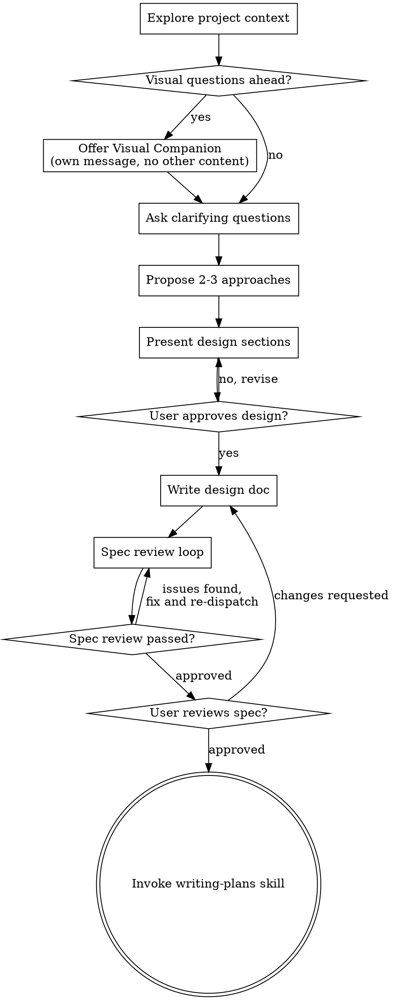

# Brainstorming Ideas Into Designs
将头脑风暴想法转化为设计

Help turn ideas into fully formed designs and specs through natural collaborative dialogue.
通过自然的协作对话，帮助将想法转化为完整的设计和规范。

Start by understanding the current project context, then ask questions one at a time to refine the idea. Once you understand what you're building, present the design and get user approval.
首先了解当前项目背景，然后逐一提问以完善想法。一旦理解你要构建的内容，就呈现设计并获得用户批准。

<HARD-GATE>
Do NOT invoke any implementation skill, write any code, scaffold any project, or take any implementation action until you have presented a design and the user has approved it. This applies to EVERY project regardless of perceived simplicity.
在呈现设计并获得用户批准之前，请勿调用任何实现技能、编写任何代码、搭建任何项目或采取任何实现行动。这适用于所有项目，无论其看似多么简单。
</HARD-GATE>

## Anti-Pattern: "This Is Too Simple To Need A Design"
反模式："这太简单了，不需要设计"

Every project goes through this process. A todo list, a single-function utility, a config change — all of them. "Simple" projects are where unexamined assumptions cause the most wasted work. The design can be short (a few sentences for truly simple projects), but you MUST present it and get approval.
每个项目都要经历这个过程。待办列表、单功能工具、配置变更——都是如此。"简单"项目恰恰是未经审视的假设造成最多浪费工作的地方。设计可以很短（对于真正简单的项目，几句话就够了），但你必须呈现它并获得批准。

## Checklist
检查清单

You MUST create a task for each of these items and complete them in order:
你必须为以下每个项目创建任务并按顺序完成：

1. **Explore project context** — check files, docs, recent commits
  **探索项目背景** — 检查文件、文档、最近的提交
2. **Offer visual companion** (if topic will involve visual questions) — this is its own message, not combined with a clarifying question. See the Visual Companion section below.
  **提供视觉伴侣**（如果主题涉及视觉问题）—— 这是独立的消息，不与澄清问题合并。请参阅下面的视觉伴侣部分。
3. **Ask clarifying questions** — one at a time, understand purpose/constraints/success criteria
  **提出澄清问题** — 一次一个，了解目的/约束/成功标准
4. **Propose 2-3 approaches** — with trade-offs and your recommendation
  **提出 2-3 种方案** — 包含权衡和你的建议
5. **Present design** — in sections scaled to their complexity, get user approval after each section
  **呈现设计** — 按复杂度分节呈现，每节后获得用户批准
6. **Write design doc** — save to `docs/superpowers/specs/YYYY-MM-DD-<topic>-design.md` and commit
  **编写设计文档** — 保存到 `docs/superpowers/specs/YYYY-MM-DD-<topic>-design.md` 并提交
7. **Spec review loop** — dispatch spec-document-reviewer subagent with precisely crafted review context (never your session history); fix issues and re-dispatch until approved (max 3 iterations, then surface to human)
  **规范审查循环** — 使用精心制作的审查上下文（绝不使用你的会话历史）调度 spec-document-reviewer 子代理；修复问题并重新调度直到获批（最多 3 次迭代，之后提交人工处理）
8. **User reviews written spec** — ask user to review the spec file before proceeding
  **用户审查书面规范** — 请用户在继续之前审查规范文件
9. **Transition to implementation** — invoke writing-plans skill to create implementation plan
  **过渡到实现** — 调用 writing-plans 技能创建实施计划

## Process Flow
流程图

**The terminal state is invoking writing-plans.** Do NOT invoke frontend-design, mcp-builder, or any other implementation skill. The ONLY skill you invoke after brainstorming is writing-plans.
**最终状态是调用 writing-plans。** 不要调用 frontend-design、mcp-builder 或任何其他实现技能。头脑风暴之后唯一调用的技能是 writing-plans。

## The Process
流程详解

**Understanding the idea:**
**理解想法：**

- Check out the current project state first (files, docs, recent commits)
  首先查看当前项目状态（文件、文档、最近的提交）
- Before asking detailed questions, assess scope: if the request describes multiple independent subsystems (e.g., "build a platform with chat, file storage, billing, and analytics"), flag this immediately. Don't spend questions refining details of a project that needs to be decomposed first.
  在提出详细问题之前，先评估范围：如果请求描述了多个独立子系统（例如"构建一个包含聊天、文件存储、计费和分析的平台"），立即标注。不要在需要先拆分的项目上花时间细化细节。
- If the project is too large for a single spec, help the user decompose into sub-projects: what are the independent pieces, how do they relate, what order should they be built? Then brainstorm the first sub-project through the normal design flow. Each sub-project gets its own spec → plan → implementation cycle.
  如果项目太大无法用单一规范涵盖，帮助用户拆分为子项目：哪些是独立的部分，它们如何关联，应该按什么顺序构建？然后通过正常的设计流程对第一个子项目进行头脑风暴。每个子项目都有自己的规范 → 计划 → 实现循环。
- For appropriately-scoped projects, ask questions one at a time to refine the idea
  对于范围适当的项目，一次提出一个问题以完善想法
- Prefer multiple choice questions when possible, but open-ended is fine too
  尽可能使用选择题，但开放式问题也可以
- Only one question per message - if a topic needs more exploration, break it into multiple questions
  每条消息只问一个问题——如果某个主题需要更多探索，请拆分为多个问题
- Focus on understanding: purpose, constraints, success criteria
  专注于理解：目的、约束、成功标准

**Exploring approaches:**
**探索方案：**

- Propose 2-3 different approaches with trade-offs
  提出 2-3 种不同方案并说明权衡
- Present options conversationally with your recommendation and reasoning
  以对话方式呈现选项，说明你的建议和理由
- Lead with your recommended option and explain why
  以你推荐的选项开头并解释原因

**Presenting the design:**
**呈现设计：**

- Once you believe you understand what you're building, present the design
  一旦你认为理解了自己要构建的内容，就呈现设计
- Scale each section to its complexity: a few sentences if straightforward, up to 200-300 words if nuanced
  根据每个部分的复杂度调整篇幅：简单的几句话，复杂的最多 200-300 字
- Ask after each section whether it looks right so far
  每个部分后询问目前看起来是否正确
- Cover: architecture, components, data flow, error handling, testing
  涵盖：架构、组件、数据流、错误处理、测试
- Be ready to go back and clarify if something doesn't make sense
  准备好在内容不合理时返回并澄清

**Design for isolation and clarity:**
**为隔离和清晰而设计：**

- Break the system into smaller units that each have one clear purpose, communicate through well-defined interfaces, and can be understood and tested independently
  将系统拆分为更小的单元，每个单元有一个明确的目的，通过定义良好的接口通信，可以独立理解和测试
- For each unit, you should be able to answer: what does it do, how do you use it, and what does it depend on?
  对于每个单元，你应该能够回答：它做什么，你怎么使用它，它依赖什么？
- Can someone understand what a unit does without reading its internals? Can you change the internals without breaking consumers? If not, the boundaries need work.
  有人能在不阅读内部实现的情况下理解一个单元的作用吗？你能在不破坏使用者的情况下更改内部实现吗？如果不能，边界需要改进。
- Smaller, well-bounded units are also easier for you to work with - you reason better about code you can hold in context at once, and your edits are more reliable when files are focused. When a file grows large, that's often a signal that it's doing too much.
  更小、边界更清晰的单元也更容易让你工作——你能更好地理解可以一次性放在上下文中的代码，当文件专注于一件事时，你的编辑也更可靠。当一个文件变得很大时，这通常是它做得太多的信号。

**Working in existing codebases:**
**在现有代码库中工作：**

- Explore the current structure before proposing changes. Follow existing patterns.
  在提出更改之前先探索当前结构。遵循现有的模式。
- Where existing code has problems that affect the work (e.g., a file that's grown too large, unclear boundaries, tangled responsibilities), include targeted improvements as part of the design - the way a good developer improves code they're working in.
  对于影响工作的现有代码问题（例如，文件过大、边界不清晰、职责纠缠），将针对性的改进作为设计的一部分——就像一个优秀的开发者在他们正在工作的代码中改进一样。
- Don't propose unrelated refactoring. Stay focused on what serves the current goal.
  不要提出无关的重构。专注于当前目标的服务。

## After the Design
设计之后

**Documentation:**
**文档：**

- Write the validated design (spec) to `docs/superpowers/specs/YYYY-MM-DD-<topic>-design.md`
  将经过验证的设计（规范）写入 `docs/superpowers/specs/YYYY-MM-DD-<topic>-design.md`
  - (User preferences for spec location override this default)
    （用户对规范位置的偏好优先于此默认设置）
- Use elements-of-style:writing-clearly-and-concisely skill if available
  如果可用，使用 elements-of-style:writing-clearly-and-concisely 技能
- Commit the design document to git
  将设计文档提交到 git

**Spec Review Loop:**
**规范审查循环：**
After writing the spec document:
编写规范文档后：

1. Dispatch spec-document-reviewer subagent (see spec-document-reviewer-prompt.md)
  调度 spec-document-reviewer 子代理（参见 spec-document-reviewer-prompt.md）
2. If Issues Found: fix, re-dispatch, repeat until Approved
  如果发现问题：修复、重新调度、重复直到批准
3. If loop exceeds 3 iterations, surface to human for guidance
  如果循环超过 3 次迭代，提交人工处理

**User Review Gate:**
**用户审查关卡：**
After the spec review loop passes, ask the user to review the written spec before proceeding:
规范审查循环通过后，请用户在继续之前审查书面规范：

> "Spec written and committed to `<path>`. Please review it and let me know if you want to make any changes before we start writing out the implementation plan."
> "规范已编写并提交到 `<path>`。请审查它，告诉我是否有任何需要修改的地方，然后我们开始编写实施计划。"

Wait for the user's response. If they request changes, make them and re-run the spec review loop. Only proceed once the user approves.
等待用户的回复。如果他们要求修改，进行修改并重新运行规范审查循环。只有在用户批准后才能继续。

**Implementation:**
**实现：**

- Invoke the writing-plans skill to create a detailed implementation plan
  调用 writing-plans 技能创建详细的实施计划
- Do NOT invoke any other skill. writing-plans is the next step.
  不要调用任何其他技能。writing-plans 是下一步。

## Key Principles
关键原则

- **One question at a time** - Don't overwhelm with multiple questions
  **一次一个问题** — 不要用多个问题让用户应接不暇
- **Multiple choice preferred** - Easier to answer than open-ended when possible
  **首选选择题** — 尽可能比开放式问题更容易回答
- **YAGNI ruthlessly** - Remove unnecessary features from all designs
  **严格遵循 YAGNI** — 从所有设计中移除不必要的功能
- **Explore alternatives** - Always propose 2-3 approaches before settling
  **探索替代方案** — 在确定之前始终提出 2-3 种方案
- **Incremental validation** - Present design, get approval before moving on
  **增量验证** — 呈现设计，获得批准后再继续
- **Be flexible** - Go back and clarify when something doesn't make sense
  **保持灵活** — 在内容不合理时返回并澄清

## Visual Companion
视觉伴侣

A browser-based companion for showing mockups, diagrams, and visual options during brainstorming. Available as a tool — not a mode. Accepting the companion means it's available for questions that benefit from visual treatment; it does NOT mean every question goes through the browser.
一个基于浏览器的伴侣，用于在头脑风暴过程中展示模型、图表和视觉选项。是一种工具而非模式。接受该伴侣意味着它可以用于需要视觉处理的问题；但并不意味着每个问题都要通过浏览器。

**Offering the companion:** When you anticipate that upcoming questions will involve visual content (mockups, layouts, diagrams), offer it once for consent:
**提供伴侣：** 当你预见到接下来的问题将涉及视觉内容（模型、布局、图表）时，提供一次以征得同意：

> "Some of what we're working on might be easier to explain if I can show it to you in a web browser. I can put together mockups, diagrams, comparisons, and other visuals as we go. This feature is still new and can be token-intensive. Want to try it? (Requires opening a local URL)"
> "我们正在做的一些内容如果能在网络浏览器中展示给你，可能更容易解释。我可以随着进度整理模型、图表、比较和其他视觉内容。这个功能还是新的，可能会消耗较多 token。想试试吗？（需要打开一个本地 URL）"

**This offer MUST be its own message.** Do not combine it with clarifying questions, context summaries, or any other content. The message should contain ONLY the offer above and nothing else. Wait for the user's response before continuing. If they decline, proceed with text-only brainstorming.
**此提议必须是一条独立的消息。** 不要将其与澄清问题、上下文摘要或任何其他内容合并。消息应仅包含上述提议，不含其他内容。在继续之前等待用户的回复。如果他们拒绝，继续纯文本头脑风暴。

**Per-question decision:** Even after the user accepts, decide FOR EACH QUESTION whether to use the browser or the terminal. The test: **would the user understand this better by seeing it than reading it?**
**逐问题决策：** 即使在用户接受之后，也要对每个问题决定是使用浏览器还是终端。判断标准：**用户通过看比读更能理解吗？**

- **Use the browser** for content that IS visual — mockups, wireframes, layout comparisons, architecture diagrams, side-by-side visual designs
  **使用浏览器** 处理确实是视觉的内容 — 模型、线框图、布局比较、架构图、并排视觉设计
- **Use the terminal** for content that is text — requirements questions, conceptual choices, tradeoff lists, A/B/C/D text options, scope decisions
  **使用终端** 处理文本内容 — 需求问题、概念选择、权衡列表、A/B/C/D 文本选项、范围决策

A question about a UI topic is not automatically a visual question. "What does personality mean in this context?" is a conceptual question — use the terminal. "Which wizard layout works better?" is a visual question — use the browser.
关于 UI 主题的问题并不自动是视觉问题。"'个性'在这个语境中意味着什么？"是一个概念性问题——使用终端。"哪种向导布局效果更好？"是一个视觉问题——使用浏览器。

If they agree to the companion, read the detailed guide before proceeding:
如果他们同意使用伴侣，继续之前请阅读详细指南：
`skills/brainstorming/visual-companion.md`
