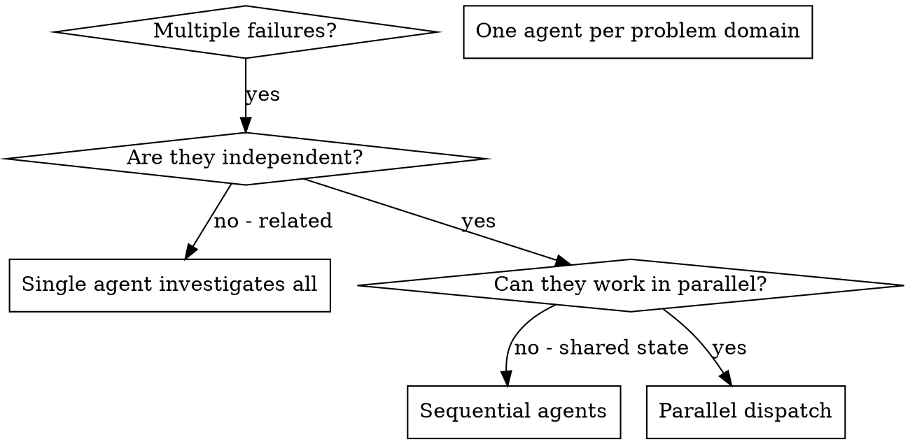

# Dispatching Parallel Agents
# 并行代理调度

## Overview
## 概述

You delegate tasks to specialized agents with isolated context. By precisely crafting their instructions and context, you ensure they stay focused and succeed at their task. They should never inherit your session's context or history — you construct exactly what they need. This also preserves your own context for coordination work.
你将任务委托给具有隔离上下文的专用代理。通过精心设计它们的指令和上下文，你确保它们保持专注并成功完成任务。它们永远不应继承你会话的上下文或历史——你精确构建它们需要的内容。这也能保留你自己的上下文用于协调工作。

When you have multiple unrelated failures (different test files, different subsystems, different bugs), investigating them sequentially wastes time. Each investigation is independent and can happen in parallel.
当你遇到多个不相关的故障（不同的测试文件、不同的子系统、不同的 bug）时，顺序调查会浪费时间。每次调查都是独立的，可以并行进行。

**Core principle:** Dispatch one agent per independent problem domain. Let them work concurrently.
**核心原则：** 为每个独立的问题域分配一个代理。让它们并发工作。

## When to Use
## 使用场景



**Use when:**
**使用场景：**
- 3+ test files failing with different root causes
  **3 个或更多测试文件因不同根本原因失败**
- Multiple subsystems broken independently
  **多个子系统独立故障**
- Each problem can be understood without context from others
  **每个问题都可以独立理解，无需其他问题的上下文**
- No shared state between investigations
  **调查之间没有共享状态**

**Don't use when:**
**不使用场景：**
- Failures are related (fix one might fix others)
  **故障是相关的（修复一个可能会修复其他）**
- Need to understand full system state
  **需要了解完整的系统状态**
- Agents would interfere with each other
  **代理之间会相互干扰**

## The Pattern
## 模式

### 1. Identify Independent Domains
### 1. 识别独立域

Group failures by what's broken:
按故障内容分组：
- File A tests: Tool approval flow
  **文件 A 测试：工具审批流程**
- File B tests: Batch completion behavior
  **文件 B 测试：批量完成行为**
- File C tests: Abort functionality
  **文件 C 测试：中止功能**

Each domain is independent - fixing tool approval doesn't affect abort tests.
每个域都是独立的——修复工具审批不会影响中止测试。

### 2. Create Focused Agent Tasks
### 2. 创建聚焦的代理任务

Each agent gets:
每个代理获得：
- **Specific scope:** One test file or subsystem
  **特定范围：** 一个测试文件或子系统
- **Clear goal:** Make these tests pass
  **明确目标：** 让这些测试通过
- **Constraints:** Don't change other code
  **约束：** 不要更改其他代码
- **Expected output:** Summary of what you found and fixed
  **预期输出：** 你发现和修复的内容摘要

### 3. Dispatch in Parallel
### 3. 并行调度

```typescript
// In Claude Code / AI environment
Task("Fix agent-tool-abort.test.ts failures")
Task("Fix batch-completion-behavior.test.ts failures")
Task("Fix tool-approval-race-conditions.test.ts failures")
// All three run concurrently
// 三个任务并发运行
```

### 4. Review and Integrate
### 4. 审查和集成

When agents return:
当代理返回时：
- Read each summary
  **阅读每个摘要**
- Verify fixes don't conflict
  **验证修复不冲突**
- Run full test suite
  **运行完整测试套件**
- Integrate all changes
  **集成所有更改**

## Agent Prompt Structure
## 代理提示结构

Good agent prompts are:
好的代理提示是：
1. **Focused** - One clear problem domain
   **聚焦** - 一个明确的问题域
2. **Self-contained** - All context needed to understand the problem
   **自包含** - 理解问题所需的所有上下文
3. **Specific about output** - What should the agent return?
   **具体说明输出** - 代理应该返回什么？

```markdown
Fix the 3 failing tests in src/agents/agent-tool-abort.test.ts:

1. "should abort tool with partial output capture" - expects 'interrupted at' in message
2. "should handle mixed completed and aborted tools" - fast tool aborted instead of completed
3. "should properly track pendingToolCount" - expects 3 results but gets 0

These are timing/race condition issues. Your task:

1. Read the test file and understand what each test verifies
2. Identify root cause - timing issues or actual bugs?
3. Fix by:
   - Replacing arbitrary timeouts with event-based waiting
   - Fixing bugs in abort implementation if found
   - Adjusting test expectations if testing changed behavior

Do NOT just increase timeouts - find the real issue.

Return: Summary of what you found and what you fixed.
```

修复 src/agents/agent-tool-abort.test.ts 中 3 个失败的测试：

1. "should abort tool with partial output capture" - expects 'interrupted at' in message
   **捕获部分输出的中止工具** - 期望消息中包含 '被中断于'
2. "should handle mixed completed and aborted tools" - fast tool aborted instead of completed
   **处理混合完成和中止的工具** - 快速工具被中止而不是完成
3. "should properly track pendingToolCount" - expects 3 results but gets 0
   **正确跟踪 pendingToolCount** - 期望 3 个结果但得到 0

这些是时序/竞态条件问题。你的任务：

1. Read the test file and understand what each test verifies
   **阅读测试文件，理解每个测试验证的内容**
2. Identify root cause - timing issues or actual bugs?
   **找出根本原因——时序问题还是实际 bug？**
3. Fix by:
   **修复方法：**
   - Replacing arbitrary timeouts with event-based waiting
     **用基于事件的等待替换任意超时**
   - Fixing bugs in abort implementation if found
     **如发现 bug 则修复中止实现中的 bug**
   - Adjusting test expectations if testing changed behavior
     **如果测试行为改变则调整测试期望**

**不要只是增加超时——找到真正的问题。**

**返回：** 你发现和修复的内容摘要

## Common Mistakes
## 常见错误

**❌ Too broad:** "Fix all the tests" - agent gets lost
**❌ 范围过广：** "修复所有测试" - 代理会迷失方向

**✅ Specific:** "Fix agent-tool-abort.test.ts" - focused scope
**✅ 具体：** "修复 agent-tool-abort.test.ts" - 聚焦的范围

**❌ No context:** "Fix the race condition" - agent doesn't know where
**❌ 缺少上下文：** "修复竞态条件" - 代理不知道在哪里

**✅ Context:** Paste the error messages and test names
**✅ 上下文：** 粘贴错误消息和测试名称

**❌ No constraints:** Agent might refactor everything
**❌ 无约束：** 代理可能会重构所有内容

**✅ Constraints:** "Do NOT change production code" or "Fix tests only"
**✅ 约束：** "不要更改生产代码"或"仅修复测试"

**❌ Vague output:** "Fix it" - you don't know what changed
**❌ 模糊输出：** "修复它" - 你不知道改变了什么

**✅ Specific:** "Return summary of root cause and changes"
**✅ 具体：** "返回根本原因和更改摘要"

## When NOT to Use
## 何时不使用

**Related failures:** Fixing one might fix others - investigate together first
**相关故障：** 修复一个可能会修复其他——首先一起调查

**Need full context:** Understanding requires seeing entire system
**需要完整上下文：** 理解需要查看整个系统

**Exploratory debugging:** You don't know what's broken yet
**探索性调试：** 你还不知道哪里坏了

**Shared state:** Agents would interfere (editing same files, using same resources)
**共享状态：** 代理会相互干扰（编辑同一文件、使用同一资源）

## Real Example from Session
## 来自会话的真实示例

**Scenario:** 6 test failures across 3 files after major refactoring
**场景：** 重大重构后 3 个文件中 6 个测试失败

**Failures:**
**故障：**
- agent-tool-abort.test.ts: 3 failures (timing issues)
  **agent-tool-abort.test.ts：3 个失败（时序问题）**
- batch-completion-behavior.test.ts: 2 failures (tools not executing)
  **batch-completion-behavior.test.ts：2 个失败（工具未执行）**
- tool-approval-race-conditions.test.ts: 1 failure (execution count = 0)
  **tool-approval-race-conditions.test.ts：1 个失败（执行计数 = 0）**

**Decision:** Independent domains - abort logic separate from batch completion separate from race conditions
**决策：** 独立域——中止逻辑与批量完成与竞态条件分离

**Dispatch:**
**调度：**
```
Agent 1 → Fix agent-tool-abort.test.ts
Agent 2 → Fix batch-completion-behavior.test.ts
Agent 3 → Fix tool-approval-race-conditions.test.ts
```

**Results:**
**结果：**
- Agent 1: Replaced timeouts with event-based waiting
  **代理 1：用基于事件的等待替换超时**
- Agent 2: Fixed event structure bug (threadId in wrong place)
  **代理 2：修复了事件结构 bug（threadId 位置错误）**
- Agent 3: Added wait for async tool execution to complete
  **代理 3：添加了等待异步工具执行完成的逻辑**

**Integration:** All fixes independent, no conflicts, full suite green
**集成：** 所有修复独立，无冲突，完整套件通过

**Time saved:** 3 problems solved in parallel vs sequentially
**节省时间：** 并行解决 3 个问题 vs 顺序解决

## Key Benefits
## 关键优势

1. **Parallelization** - Multiple investigations happen simultaneously
   **并行化** - 多个调查同时进行
2. **Focus** - Each agent has narrow scope, less context to track
   **聚焦** - 每个代理范围狭窄，需要跟踪的上下文更少
3. **Independence** - Agents don't interfere with each other
   **独立性** - 代理之间不会相互干扰
4. **Speed** - 3 problems solved in time of 1
   **速度** - 1 个时间解决 3 个问题

## Verification
## 验证

After agents return:
代理返回后：
- **Review each summary** - Understand what changed
  **审查每个摘要** - 理解改变了什么
- **Check for conflicts** - Did agents edit same code?
  **检查冲突** - 代理是否编辑了相同的代码？
- **Run full suite** - Verify all fixes work together
  **运行完整套件** - 验证所有修复一起工作
- **Spot check** - Agents can make systematic errors
  **抽查** - 代理可能会犯系统性错误

## Real-World Impact
## 实际影响

From debugging session (2025-10-03):
来自调试会话（2025-10-03）：
- 6 failures across 3 files
  **3 个文件中 6 个故障**
- 3 agents dispatched in parallel
  **并行调度 3 个代理**
- All investigations completed concurrently
  **所有调查并发完成**
- All fixes integrated successfully
  **所有修复成功集成**
- Zero conflicts between agent changes
  **代理更改之间零冲突**
