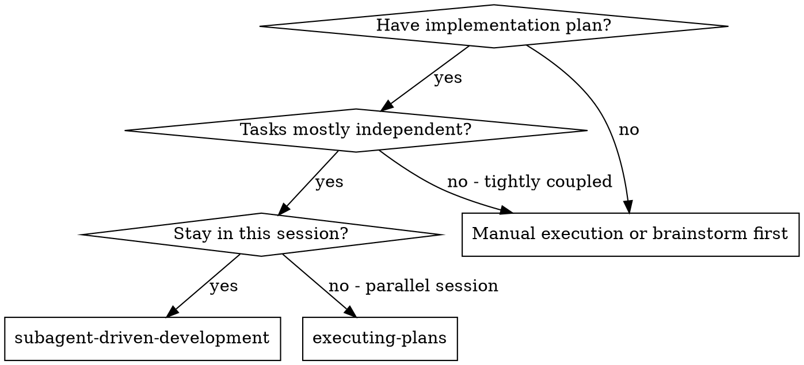
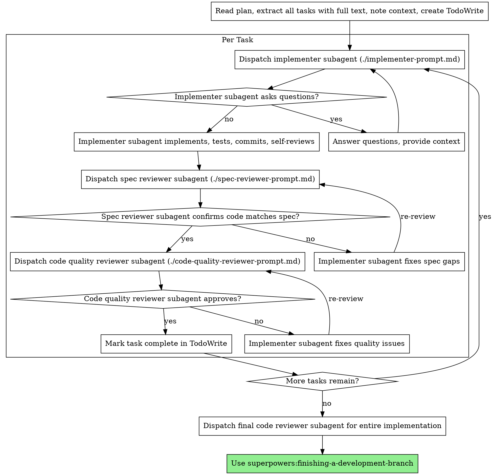

name: subagent-driven-development
description: 在当前会话中执行包含独立任务的实施计划时使用

# Subagent-Driven Development
子代理驱动开发

Execute plan by dispatching fresh subagent per task, with two-stage review after each: spec compliance review first, then code quality review.
通过为每个任务分派新的子代理来执行计划，每个任务后进行两阶段审查：首先进行规范合规审查，然后进行代码质量审查。

**Why subagents:** You delegate tasks to specialized agents with isolated context. By precisely crafting their instructions and context, you ensure they stay focused and succeed at their task. They should never inherit your session's context or history — you construct exactly what they need. This also preserves your own context for coordination work.
**子代理的优势：** 将任务委托给具有隔离上下文的专门代理。通过精确设计他们的指令和上下文，你可以确保他们保持专注并成功完成任务。他们永远不应该继承你会话的上下文或历史记录——你要精确构建他们所需的内容。这也保留了你自己的上下文用于协调工作。

**Core principle:** Fresh subagent per task + two-stage review (spec then quality) = high quality, fast iteration
**核心原则：** 每个任务使用新子代理 + 两阶段审查（先规范后质量）= 高质量、快速迭代

## When to Use
何时使用



**vs. Executing Plans (parallel session):**
**与执行计划（并行会话）的对比：**
- Same session (no context switch)
  同一会话（无需上下文切换）
- Fresh subagent per task (no context pollution)
  每个任务使用新子代理（无上下文污染）
- Two-stage review after each task: spec compliance first, then code quality
  每个任务后进行两阶段审查：首先规范合规，然后代码质量
- Faster iteration (no human-in-loop between tasks)
  更快迭代（任务之间无人工介入）

## The Process
执行流程



## Model Selection
模型选择

Use the least powerful model that can handle each role to conserve cost and increase speed.
使用能够处理每个角色的最弱模型以节省成本并提高速度。

**Mechanical implementation tasks** (isolated functions, clear specs, 1-2 files): use a fast, cheap model. Most implementation tasks are mechanical when the plan is well-specified.
**机械实现任务**（独立函数、清晰规范、1-2个文件）：使用快速、便宜的模型。当计划指定得很好时，大多数实现任务都是机械性的。

**Integration and judgment tasks** (multi-file coordination, pattern matching, debugging): use a standard model.
**集成和判断任务**（多文件协调、模式匹配、调试）：使用标准模型。

**Architecture, design, and review tasks**: use the most capable available model.
**架构、设计和审查任务**：使用最有能力的可用模型。

**Task complexity signals:**
**任务复杂度信号：**
- Touches 1-2 files with a complete spec → cheap model
  涉及1-2个文件且有完整规范 → 使用便宜模型
- Touches multiple files with integration concerns → standard model
  涉及多个文件且有集成问题 → 使用标准模型
- Requires design judgment or broad codebase understanding → most capable model
  需要设计判断或广泛的代码库理解 → 使用最有能力的模型

## Handling Implementer Status
处理实现者状态

Implementer subagents report one of four statuses. Handle each appropriately:
实现者子代理报告四种状态之一。相应处理：

**DONE:** Proceed to spec compliance review.
**DONE（完成）：** 继续进行规范合规审查。

**DONE_WITH_CONCERNS:** The implementer completed the work but flagged doubts. Read the concerns before proceeding. If the concerns are about correctness or scope, address them before review. If they're observations (e.g., "this file is getting large"), note them and proceed to review.
**DONE_WITH_CONCERNS（有疑虑的完成）：** 实现者完成了工作但标记了疑虑。在继续之前阅读这些疑虑。如果疑虑涉及正确性或范围，请在审查前解决。如果它们是观察结果（例如"这个文件变得很大"），请记录下来并继续审查。

**NEEDS_CONTEXT:** The implementer needs information that wasn't provided. Provide the missing context and re-dispatch.
**NEEDS_CONTEXT（需要上下文）：** 实现者需要未提供的信息。提供缺失的上下文并重新分派。

**BLOCKED:** The implementer cannot complete the task. Assess the blocker:
**BLOCKED（阻塞）：** 实现者无法完成任务。评估阻塞原因：
1. If it's a context problem, provide more context and re-dispatch with the same model
   如果是上下文问题，提供更多上下文并使用相同模型重新分派
2. If the task requires more reasoning, re-dispatch with a more capable model
   如果任务需要更多推理，使用更有能力的模型重新分派
3. If the task is too large, break it into smaller pieces
   如果任务太大，将其拆分为更小的部分
4. If the plan itself is wrong, escalate to the human
   如果计划本身有问题，升级给人工

**Never** ignore an escalation or force the same model to retry without changes. If the implementer said it's stuck, something needs to change.
**绝对不要**忽略升级或强制相同模型在没有变更的情况下重试。如果实现者说卡住了，就需要做出改变。

## Prompt Templates
提示模板

- `./implementer-prompt.md` - Dispatch implementer subagent
  分派实现者子代理
- `./spec-reviewer-prompt.md` - Dispatch spec compliance reviewer subagent
  分派规范合规审查者子代理
- `./code-quality-reviewer-prompt.md` - Dispatch code quality reviewer subagent
  分派代码质量审查者子代理

## Example Workflow
示例工作流

```
You: I'm using Subagent-Driven Development to execute this plan.

[Read plan file once: docs/superpowers/plans/feature-plan.md]
[Extract all 5 tasks with full text and context]
[Create TodoWrite with all tasks]

Task 1: Hook installation script

[Get Task 1 text and context (already extracted)]
[Dispatch implementation subagent with full task text + context]

Implementer: "Before I begin - should the hook be installed at user or system level?"

You: "User level (~/.config/superpowers/hooks/)"

Implementer: "Got it. Implementing now..."
[Later] Implementer:
  - Implemented install-hook command
  - Added tests, 5/5 passing
  - Self-review: Found I missed --force flag, added it
  - Committed

[Dispatch spec compliance reviewer]
Spec reviewer: ✅ Spec compliant - all requirements met, nothing extra

[Get git SHAs, dispatch code quality reviewer]
Code reviewer: Strengths: Good test coverage, clean. Issues: None. Approved.

[Mark Task 1 complete]

Task 2: Recovery modes

[Get Task 2 text and context (already extracted)]
[Dispatch implementation subagent with full task text + context]

Implementer: [No questions, proceeds]
Implementer:
  - Added verify/repair modes
  - 8/8 tests passing
  - Self-review: All good
  - Committed

[Dispatch spec compliance reviewer]
Spec reviewer: ❌ Issues:
  - Missing: Progress reporting (spec says "report every 100 items")
  - Extra: Added --json flag (not requested)

[Implementer fixes issues]
Implementer: Removed --json flag, added progress reporting

[Spec reviewer reviews again]
Spec reviewer: ✅ Spec compliant now

[Dispatch code quality reviewer]
Code reviewer: Strengths: Solid. Issues (Important): Magic number (100)

[Implementer fixes]
Implementer: Extracted PROGRESS_INTERVAL constant

[Code reviewer reviews again]
Code reviewer: ✅ Approved

[Mark Task 2 complete]

...

[After all tasks]
[Dispatch final code-reviewer]
Final reviewer: All requirements met, ready to merge

Done!
```

## Advantages
优势

**vs. Manual execution:**
**与手动执行的对比：**
- Subagents follow TDD naturally
  子代理自然遵循TDD
- Fresh context per task (no confusion)
  每个任务使用全新上下文（无混淆）
- Parallel-safe (subagents don't interfere)
  并行安全（子代理互不干扰）
- Subagent can ask questions (before AND during work)
  子代理可以提问（工作前和工作期间都可以）

**vs. Executing Plans:**
**与执行计划的对比：**
- Same session (no handoff)
  同一会话（无需交接）
- Continuous progress (no waiting)
  持续进展（无需等待）
- Review checkpoints automatic
  审查检查点自动进行

**Efficiency gains:**
**效率提升：**
- No file reading overhead (controller provides full text)
  无文件读取开销（控制器提供完整文本）
- Controller curates exactly what context is needed
  控制器精确策划所需的上下文
- Subagent gets complete information upfront
  子代理预先获得完整信息
- Questions surfaced before work begins (not after)
  问题在工作开始前浮现（而非之后）

**Quality gates:**
**质量门禁：**
- Self-review catches issues before handoff
  自我审查在交接前捕获问题
- Two-stage review: spec compliance, then code quality
  两阶段审查：规范合规，然后代码质量
- Review loops ensure fixes actually work
  审查循环确保修复真正有效
- Spec compliance prevents over/under-building
  规范合规防止过度/不足构建
- Code quality ensures implementation is well-built
  代码质量确保实现构建良好

**Cost:**
**成本：**
- More subagent invocations (implementer + 2 reviewers per task)
  更多的子代理调用（每个任务实现者 + 2个审查者）
- Controller does more prep work (extracting all tasks upfront)
  控制器做更多准备工作（预先提取所有任务）
- Review loops add iterations
  审查循环增加迭代次数
- But catches issues early (cheaper than debugging later)
  但能及早发现问题（比后期调试更便宜）

## Red Flags
危险信号

**Never:**
**绝对不要：**
- Start implementation on main/master branch without explicit user consent
  未经用户明确同意在 main/master 分支上开始实现
- Skip reviews (spec compliance OR code quality)
  跳过审查（规范合规或代码质量）
- Proceed with unfixed issues
  带着未修复的问题继续
- Dispatch multiple implementation subagents in parallel (conflicts)
  并行分派多个实现子代理（会产生冲突）
- Make subagent read plan file (provide full text instead)
  让子代理读取计划文件（改为提供完整文本）
- Skip scene-setting context (subagent needs to understand where task fits)
  跳过场景设置上下文（子代理需要理解任务在何处适用）
- Ignore subagent questions (answer before letting them proceed)
  忽略子代理的问题（让他们继续之前先回答）
- Accept "close enough" on spec compliance (spec reviewer found issues = not done)
  接受规范合规的"差不多"（规范审查者发现问题 = 未完成）
- Skip review loops (reviewer found issues = implementer fixes = review again)
  跳过审查循环（审查者发现问题 = 实现者修复 = 再次审查）
- Let implementer self-review replace actual review (both are needed)
  让实现者自我审查替代实际审查（两者都需要）
- **Start code quality review before spec compliance is ✅** (wrong order)
  **在规范合规通过前开始代码质量审查**（顺序错误）
- Move to next task while either review has open issues
  当任一审查有未解决问题时移动到下一个任务

**If subagent asks questions:**
**如果子代理提问：**
- Answer clearly and completely
  清晰完整地回答
- Provide additional context if needed
  必要时提供额外上下文
- Don't rush them into implementation
  不要催促他们进入实现

**If reviewer finds issues:**
**如果审查者发现问题：**
- Implementer (same subagent) fixes them
  实现者（同一子代理）修复这些问题
- Reviewer reviews again
  审查者再次审查
- Repeat until approved
  重复直到批准
- Don't skip the re-review
  不要跳过重新审查

**If subagent fails task:**
**如果子代理任务失败：**
- Dispatch fix subagent with specific instructions
  用具体指令分派修复子代理
- Don't try to fix manually (context pollution)
  不要尝试手动修复（会导致上下文污染）

## Integration
集成

**Required workflow skills:**
**必需的工作流技能：**
- **superpowers:using-git-worktrees** - REQUIRED: Set up isolated workspace before starting
  **superpowers:using-git-worktrees** - 必需：在开始前设置隔离的工作空间
- **superpowers:writing-plans** - Creates the plan this skill executes
  **superpowers:writing-plans** - 创建此技能执行的计划
- **superpowers:requesting-code-review** - Code review template for reviewer subagents
  **superpowers:requesting-code-review** - 审查者子代理的代码审查模板
- **superpowers:finishing-a-development-branch** - Complete development after all tasks
  **superpowers:finishing-a-development-branch** - 所有任务后完成开发

**Subagents should use:**
**子代理应使用：**
- **superpowers:test-driven-development** - Subagents follow TDD for each task
  **superpowers:test-driven-development** - 子代理对每个任务遵循TDD

**Alternative workflow:**
**替代工作流：**
- **superpowers:executing-plans** - Use for parallel session instead of same-session execution
  **superpowers:executing-plans** - 用于并行会话而非同一会话执行
