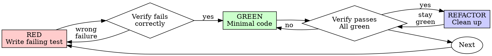

# Test-Driven Development (TDD)
# 测试驱动开发（TDD）

## Overview
## 概述

Write the test first. Watch it fail. Write minimal code to pass.
**先写测试。观察它失败。编写最少的代码使其通过。**

**Core principle:** If you didn't watch the test fail, you don't know if it tests the right thing.
**核心原则：** 如果你没有观察测试失败，你就不知道它是否测试了正确的东西。

**Violating the letter of the rules is violating the spirit of the rules.**
**违反规则的字面意思就是违反规则的精神。**

## When to Use
## 何时使用

**Always:**
**始终：**
  - New features
    **新功能**
  - Bug fixes
    **Bug 修复**
  - Refactoring
    **重构**
  - Behavior changes
    **行为变更**

**Exceptions (ask your human partner):**
**例外（请咨询你的搭档）：**
  - Throwaway prototypes
    **一次性原型**
  - Generated code
    **生成的代码**
  - Configuration files
    **配置文件**

Thinking "skip TDD just this once"? Stop. That's rationalization.
想着"就跳过这一次 TDD"？停下来。那是自我合理化。

## The Iron Law
## 铁律

```
NO PRODUCTION CODE WITHOUT A FAILING TEST FIRST
没有先失败的测试就不能写生产代码
```

Write code before the test? Delete it. Start over.
在测试之前写了代码？删掉它。重新开始。

**No exceptions:**
**没有例外：**
  - Don't keep it as "reference"
    **不要把它作为"参考"保留**
  - Don't "adapt" it while writing tests
    **不要在写测试时"改编"它**
  - Don't look at it
    **不要看它**
  - Delete means delete
    **删除就是删除**

Implement fresh from tests. Period.
从测试开始全新实现。就这样。

## Red-Green-Refactor
## 红-绿-重构



### RED - Write Failing Test
### RED - 编写失败的测试

Write one minimal test showing what should happen.
**编写一个最小的测试，展示应该发生什么。**

<Good>
```typescript
test('retries failed operations 3 times', async () => {
  let attempts = 0;
  const operation = () => {
    attempts++;
    if (attempts < 3) throw new Error('fail');
    return 'success';
  };

  const result = await retryOperation(operation);

  expect(result).toBe('success');
  expect(attempts).toBe(3);
});
```
Clear name, tests real behavior, one thing
**名称清晰，测试真实行为，一件事**
</Good>

<Bad>
```typescript
test('retry works', async () => {
  const mock = jest.fn()
    .mockRejectedValueOnce(new Error())
    .mockRejectedValueOnce(new Error())
    .mockResolvedValueOnce('success');
  await retryOperation(mock);
  expect(mock).toHaveBeenCalledTimes(3);
});
```
Vague name, tests mock not code
**名称模糊，测试 mock 而不是真实代码**
</Bad>

**Requirements:**
**要求：**
  - One behavior
    **一个行为**
  - Clear name
    **清晰的名称**
  - Real code (no mocks unless unavoidable)
    **真实代码（除非不可避免，否则不用 mock）**

### Verify RED - Watch It Fail
### 验证 RED - 观察它失败

**MANDATORY. Never skip.**
**强制要求。永远不要跳过。**

```bash
npm test path/to/test.test.ts
```

Confirm:
**确认：**
  - Test fails (not errors)
    **测试失败（不是错误）**
  - Failure message is expected
    **失败信息符合预期**
  - Fails because feature missing (not typos)
    **因为功能缺失而失败（不是因为拼写错误）**

**Test passes?** You're testing existing behavior. Fix test.
**测试通过了？** 你在测试已有行为。修复测试。

**Test errors?** Fix error, re-run until it fails correctly.
**测试报错了？** 修复错误，重新运行直到正确失败。

### GREEN - Minimal Code
### GREEN - 最少代码

Write simplest code to pass the test.
**编写最简单的代码使测试通过。**

<Good>
```typescript
async function retryOperation<T>(fn: () => Promise<T>): Promise<T> {
  for (let i = 0; i < 3; i++) {
    try {
      return await fn();
    } catch (e) {
      if (i === 2) throw e;
    }
  }
  throw new Error('unreachable');
}
```
Just enough to pass
**刚好够通过**
</Good>

<Bad>
```typescript
async function retryOperation<T>(
  fn: () => Promise<T>,
  options?: {
    maxRetries?: number;
    backoff?: 'linear' | 'exponential';
    onRetry?: (attempt: number) => void;
  }
): Promise<T> {
  // YAGNI
}
```
Over-engineered
**过度设计**
</Bad>

Don't add features, refactor other code, or "improve" beyond the test.
**不要添加功能，不要重构其他代码，也不要在测试要求之外"改进"。**

### Verify GREEN - Watch It Pass
### 验证 GREEN - 观察它通过

**MANDATORY.**
**强制要求。**

```bash
npm test path/to/test.test.ts
```

Confirm:
**确认：**
  - Test passes
    **测试通过**
  - Other tests still pass
    **其他测试仍然通过**
  - Output pristine (no errors, warnings)
    **输出干净（无错误、无警告）**

**Test fails?** Fix code, not test.
**测试失败了？** 修复代码，不是测试。

**Other tests fail?** Fix now.
**其他测试失败了？** 现在修复。

### REFACTOR - Clean Up
### REFACTOR - 清理

After green only:
**只有在 green 阶段之后：**
  - Remove duplication
    **消除重复**
  - Improve names
    **改进名称**
  - Extract helpers
    **提取辅助函数**

Keep tests green. Don't add behavior.
**保持测试为绿色。不要添加行为。**

### Repeat
### 重复

Next failing test for next feature.
**下一个失败测试对应下一个功能。**

## Good Tests
## 好的测试

| Quality | Good | Bad |
|---------|------|-----|
| **Minimal** | One thing. "and" in name? Split it. | `test('validates email and domain and whitespace')` |
| **Minimal / 最小** | 一件事。名称里有"and"？拆分它。 | `test('validates email and domain and whitespace')` |
| **Clear** | Name describes behavior | `test('test1')` |
| **Clear / 清晰** | 名称描述行为 | `test('test1')` |
| **Shows intent** | Demonstrates desired API | Obscures what code should do |
| **Shows intent / 展示意图** | 展示期望的 API | 掩盖代码应该做什么 |

## Why Order Matters
## 为什么顺序重要

**"I'll write tests after to verify it works"**
**"我会在实现后再写测试来验证它是否工作"**

Tests written after code pass immediately. Passing immediately proves nothing:
**代码写完之后写的测试会立即通过。立即通过什么都证明不了：**
  - Might test wrong thing
    **可能测试了错误的东西**
  - Might test implementation, not behavior
    **可能测试的是实现而不是行为**
  - Might miss edge cases you forgot
    **可能遗漏了你忘记的边界情况**
  - You never saw it catch the bug
    **你从未见过它捕获 bug**

Test-first forces you to see the test fail, proving it actually tests something.
**测试优先迫使你看到测试失败，证明它确实在测试某些东西。**

**"I already manually tested all the edge cases"**
**"我已经手动测试了所有边界情况"**

Manual testing is ad-hoc. You think you tested everything but:
**手动测试是临时性的。你以为测试了所有内容但：**
  - No record of what you tested
    **没有记录你测试了什么**
  - Can't re-run when code changes
    **代码变更时无法重新运行**
  - Easy to forget cases under pressure
    **在压力下容易忘记边界情况**
  - "It worked when I tried it" ≠ comprehensive
    **"我试的时候可以工作"不等于全面测试**

Automated tests are systematic. They run the same way every time.
**自动化测试是系统性的。它们每次都以相同方式运行。**

**"Deleting X hours of work is wasteful"**
**"删除 X 小时的工作是浪费"**

Sunk cost fallacy. The time is already gone. Your choice now:
**沉没成本谬误。时间已经过去了。你现在的选择：**
  - Delete and rewrite with TDD (X more hours, high confidence)
    **删除并用 TDD 重写（再花 X 小时，高置信度）**
  - Keep it and add tests after (30 min, low confidence, likely bugs)
    **保留并在之后添加测试（30 分钟，低置信度，可能有 bug）**

The "waste" is keeping code you can't trust. Working code without real tests is technical debt.
**"浪费"是保留你无法信任的代码。没有真正测试的工作代码是技术债务。**

**"TDD is dogmatic, being pragmatic means adapting"**
**"TDD 是教条的，务实意味着变通"**

TDD IS pragmatic:
**TDD 本身就是务实的：**
  - Finds bugs before commit (faster than debugging after)
    **在提交前发现 bug（比之后调试更快）**
  - Prevents regressions (tests catch breaks immediately)
    **防止回归（测试立即捕获破坏）**
  - Documents behavior (tests show how to use code)
    **记录行为（测试展示如何使用代码）**
  - Enables refactoring (change freely, tests catch breaks)
    **支持重构（自由修改，测试捕获破坏）**

"Pragmatic" shortcuts = debugging in production = slower.
**"务实"的捷径 = 在生产环境调试 = 更慢。**

**"Tests after achieve the same goals - it's spirit not ritual"**
**"之后写测试也能达到同样目标 - 重要的是精神而不是仪式"**

No. Tests-after answer "What does this do?" Tests-first answer "What should this do?"
**不是的。测试之后回答"这是做什么的？"测试优先回答"这应该做什么？"**

Tests-after are biased by your implementation. You test what you built, not what's required. You verify remembered edge cases, not discovered ones.
**测试之后会受你的实现影响。你测试的是你构建的东西，而不是需要的。你验证的是记住的边界情况，而不是发现的边界情况。**

Tests-first force edge case discovery before implementing. Tests-after verify you remembered everything (you didn't).
**测试优先强制在实现前发现边界情况。测试之后验证你记住了所有东西（你没有）。**

30 minutes of tests after ≠ TDD. You get coverage, lose proof tests work.
**之后写 30 分钟测试 ≠ TDD。你获得了覆盖率，失去了测试有效的证明。**

## Common Rationalizations
## 常见的自我合理化

| Excuse | Reality |
|--------|---------|
| "Too simple to test" | Simple code breaks. Test takes 30 seconds. |
| **借口** | **现实** |
| "太简单不需要测试" | **简单的代码也会出错。测试只需 30 秒。** |
| "I'll test after" | Tests passing immediately prove nothing. |
| **我之后测试** | **测试立即通过什么都证明不了。** |
| "Tests after achieve same goals" | Tests-after = "what does this do?" Tests-first = "what should this do?" |
| **之后测试也能达到同样目标** | **之后测试 = "这是做什么的？" 测试优先 = "这应该做什么？"** |
| "Already manually tested" | Ad-hoc ≠ systematic. No record, can't re-run. |
| **已经手动测试了** | **临时 ≠ 系统。无记录，无法重运行。** |
| "Deleting X hours is wasteful" | Sunk cost fallacy. Keeping unverified code is technical debt. |
| **删除 X 小时的工作是浪费** | **沉没成本谬误。保留未验证代码是技术债务。** |
| "Keep as reference, write tests first" | You'll adapt it. That's testing after. Delete means delete. |
| **保留作为参考，先写测试** | **你会改编它。那就是之后测试。删除就是删除。** |
| "Need to explore first" | Fine. Throw away exploration, start with TDD. |
| **需要先探索** | **可以。抛弃探索，从 TDD 开始。** |
| "Test hard = design unclear" | Listen to test. Hard to test = hard to use. |
| **测试难 = 设计不清晰** | **倾听测试。难以测试 = 难以使用。** |
| "TDD will slow me down" | TDD faster than debugging. Pragmatic = test-first. |
| **TDD 会拖慢我** | **TDD 比调试更快。务实 = 测试优先。** |
| "Manual test faster" | Manual doesn't prove edge cases. You'll re-test every change. |
| **手动测试更快** | **手动不能证明边界情况。每次变更都要重新测试。** |
| "Existing code has no tests" | You're improving it. Add tests for existing code. |
| **现有代码没有测试** | **你在改进它。为现有代码添加测试。** |

## Red Flags - STOP and Start Over
## 危险信号 - 停下来重新开始

  - Code before test
    **在测试之前写了代码**
  - Test after implementation
    **在实现之后写测试**
  - Test passes immediately
    **测试立即通过**
  - Can't explain why test failed
    **无法解释为什么测试失败**
  - Tests added "later"
    **之后"再"添加测试**
  - Rationalizing "just this once"
    **合理化"就这一次"**
  - "I already manually tested it"
    **"我已经手动测试了"**
  - "Tests after achieve the same purpose"
    **"之后测试也能达到同样目的"**
  - "It's about spirit not ritual"
    **"重要的是精神而不是仪式"**
  - "Keep as reference" or "adapt existing code"
    **"保留作为参考"或"改编现有代码"**
  - "Already spent X hours, deleting is wasteful"
    **"已经花了 X 小时，删除是浪费"**
  - "TDD is dogmatic, I'm being pragmatic"
    **"TDD 是教条的，我很务实"**
  - "This is different because..."
    **"这不一样因为..."**

**All of these mean: Delete code. Start over with TDD.**
**所有这些都意味着：删除代码。从 TDD 重新开始。**

## Example: Bug Fix
## 示例：Bug 修复

**Bug:** Empty email accepted
**Bug：** 空邮箱被接受

**RED**
```typescript
test('rejects empty email', async () => {
  const result = await submitForm({ email: '' });
  expect(result.error).toBe('Email required');
});
```

**Verify RED**
```bash
$ npm test
FAIL: expected 'Email required', got undefined
```

**GREEN**
```typescript
function submitForm(data: FormData) {
  if (!data.email?.trim()) {
    return { error: 'Email required' };
  }
  // ...
}
```

**Verify GREEN**
```bash
$ npm test
PASS
```

**REFACTOR**
Extract validation for multiple fields if needed.
**如有需要，为多个字段提取验证逻辑。**

## Verification Checklist
## 验证清单

Before marking work complete:
**在标记工作完成之前：**

  - [ ] Every new function/method has a test
    **每个新函数/方法都有测试**
  - [ ] Watched each test fail before implementing
    **在实现前观察每个测试失败**
  - [ ] Each test failed for expected reason (feature missing, not typo)
    **每个测试失败原因符合预期（功能缺失，不是拼写错误）**
  - [ ] Wrote minimal code to pass each test
    **为每个测试编写了最少代码**
  - [ ] All tests pass
    **所有测试通过**
  - [ ] Output pristine (no errors, warnings)
    **输出干净（无错误、无警告）**
  - [ ] Tests use real code (mocks only if unavoidable)
    **测试使用真实代码（除非不可避免否则不用 mock）**
  - [ ] Edge cases and errors covered
    **覆盖边界情况和错误**

Can't check all boxes? You skipped TDD. Start over.
**无法勾选所有选项？你跳过了 TDD。重新开始。**

## When Stuck
## 遇到困难时

| Problem | Solution |
|---------|----------|
| Don't know how to test | Write wished-for API. Write assertion first. Ask your human partner. |
| **问题** | **解决方案** |
| 不知道如何测试 | **写出期望的 API。先写断言。咨询你的搭档。** |
| Test too complicated | Design too complicated. Simplify interface. |
| **测试太复杂** | **设计太复杂。简化接口。** |
| Must mock everything | Code too coupled. Use dependency injection. |
| **必须 mock 一切** | **代码耦合太紧。使用依赖注入。** |
| Test setup huge | Extract helpers. Still complex? Simplify design. |
| **测试设置很大** | **提取辅助函数。还是复杂？简化设计。** |

## Debugging Integration
## 调试集成

Bug found? Write failing test reproducing it. Follow TDD cycle. Test proves fix and prevents regression.
**发现 bug？写一个复现它的失败测试。遵循 TDD 循环。测试证明修复并防止回归。**

Never fix bugs without a test.
**永远不要在没有测试的情况下修复 bug。**

## Testing Anti-Patterns
## 测试反模式

When adding mocks or test utilities, read @testing-anti-patterns.md to avoid common pitfalls:
**添加 mock 或测试工具时，阅读 @testing-anti-patterns.md 以避免常见陷阱：**
  - Testing mock behavior instead of real behavior
    **测试 mock 行为而不是真实行为**
  - Adding test-only methods to production classes
    **向生产类添加仅用于测试的方法**
  - Mocking without understanding dependencies
    **不理解依赖就使用 mock**

## Final Rule
## 最终规则

```
Production code → test exists and failed first
生产代码 → 测试存在且先失败

Otherwise → not TDD
否则 → 不是 TDD
```

No exceptions without your human partner's permission.
**未经搭档许可没有例外。**
