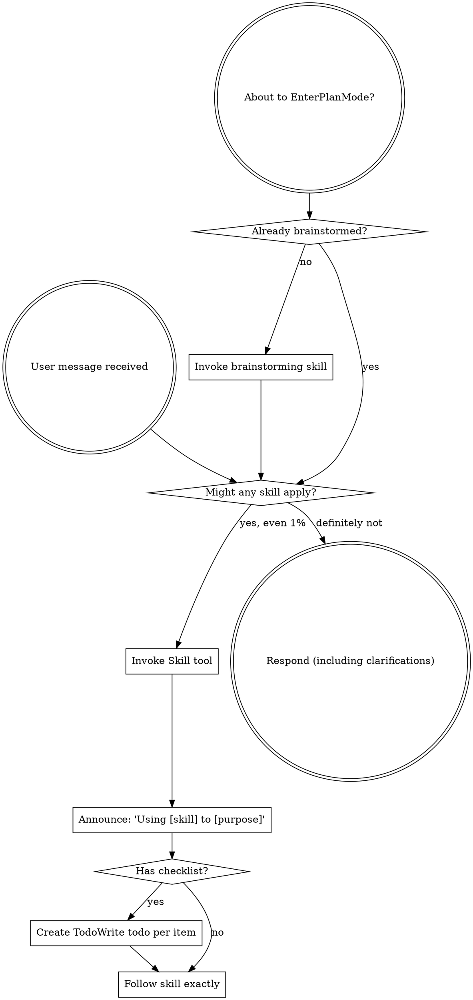
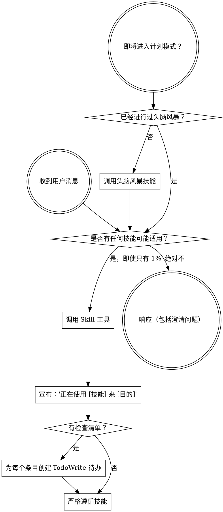

<SUBAGENT-STOP>
If you were dispatched as a subagent to execute a specific task, skip this skill.
如果你是作为子代理被派送来执行特定任务的，请跳过此技能。
</SUBAGENT-STOP>

<EXTREMELY-IMPORTANT>
If you think there is even a 1% chance a skill might apply to what you are doing, you ABSOLUTELY MUST invoke the skill.

IF A SKILL APPLIES TO YOUR TASK, YOU DO NOT HAVE A CHOICE. YOU MUST USE IT.

This is not negotiable. This is not optional. You cannot rationalize your way out of this.
如果你认为某个技能有哪怕 1% 的可能性适用于你所做的事情，你必须绝对调用该技能。

如果某个技能适用于你的任务，你没有选择。你必须使用它。

这不容协商。这不是可选的。你不能通过理性推理来回避这一点。
</EXTREMELY-IMPORTANT>

## Instruction Priority
## 指令优先级

Superpowers skills override default system prompt behavior, but **user instructions always take precedence**:
超级能力技能会覆盖默认的系统提示行为，但**用户指令始终优先**：

  - **User's explicit instructions** (CLAUDE.md, GEMINI.md, AGENTS.md, direct requests) — highest priority
  - **用户的明确指令**（CLAUDE.md、GEMINI.md、AGENTS.md、直接请求）— 最高优先级
  - **Superpowers skills** — override default system behavior where they conflict
  - **超能力技能**— 在与默认系统行为冲突时覆盖默认行为
  - **Default system prompt** — lowest priority
  - **默认系统提示**— 最低优先级

  If CLAUDE.md, GEMINI.md, or AGENTS.md says "don't use TDD" and a skill says "always use TDD," follow the user's instructions. The user is in control.
  如果 CLAUDE.md、GEMINI.md 或 AGENTS.md 说"不要使用 TDD"，而某个技能说"始终使用 TDD"，请遵循用户的指令。用户说了算。

## How to Access Skills
## 如何访问技能

**In Claude Code:** Use the `Skill` tool. When you invoke a skill, its content is loaded and presented to you—follow it directly. Never use the Read tool on skill files.
**在 Claude Code 中：** 使用 `Skill` 工具。调用技能时，其内容会被加载并呈现给你——直接遵循它。永远不要用 Read 工具读取技能文件。

**In Gemini CLI:** Skills activate via the `activate_skill` tool. Gemini loads skill metadata at session start and activates the full content on demand.
**在 Gemini CLI 中：** 技能通过 `activate_skill` 工具激活。Gemini 在会话开始时加载技能元数据，并按需激活完整内容。

**In other environments:** Check your platform's documentation for how skills are loaded.
**在其他环境中：** 查看你平台的文档以了解技能如何加载。

## Platform Adaptation
## 平台适配

Skills use Claude Code tool names. Non-CC platforms: see `references/codex-tools.md` (Codex) for tool equivalents. Gemini CLI users get the tool mapping loaded automatically via GEMINI.md.
技能使用 Claude Code 工具名称。非 CC 平台：请参阅 `references/codex-tools.md`（Codex）了解工具对应关系。Gemini CLI 用户通过 GEMINI.md 自动加载工具映射。

# Using Skills
# 使用技能

## The Rule
## 规则

**Invoke relevant or requested skills BEFORE any response or action.** Even a 1% chance a skill might apply means that you should invoke the skill to check. If an invoked skill turns out to be wrong for the situation, you don't need to use it.
**在任何响应或操作之前调用相关或请求的技能。** 即使某个技能有 1% 的可能性适用，也应该调用该技能来检查。如果调用的技能被证明不适用于该情况，你不需要使用它。

## Red Flags
## 危险信号

These thoughts mean STOP—you're rationalizing:
这些想法意味着停止——你在自我合理化：

| Thought | Reality |
|---------|---------|
| "This is just a simple question" | Questions are tasks. Check for skills. |
| "I need more context first" | Skill check comes BEFORE clarifying questions. |
| "Let me explore the codebase first" | Skills tell you HOW to explore. Check first. |
| "I can check git/files quickly" | Files lack conversation context. Check for skills. |
| "Let me gather information first" | Skills tell you HOW to gather information. |
| "This doesn't need a formal skill" | If a skill exists, use it. |
| "I remember this skill" | Skills evolve. Read current version. |
| "This doesn't count as a task" | Action = task. Check for skills. |
| "The skill is overkill" | Simple things become complex. Use it. |
| "I'll just do this one thing first" | Check BEFORE doing anything. |
| "This feels productive" | Undisciplined action wastes time. Skills prevent this. |
| "I know what that means" | Knowing the concept ≠ using the skill. Invoke it. |

| 想法 | 现实 |
|---------|---------|
| "这只是一个简单的问题" | 问题也是任务。检查是否有技能适用。 |
| "我需要先获取更多上下文" | 技能检查在澄清问题之前进行。 |
| "让我先探索代码库" | 技能告诉你如何探索。先检查。 |
| "我可以快速检查 git/文件" | 文件缺少对话上下文。检查是否有技能。 |
| "让我先收集信息" | 技能告诉你如何收集信息。 |
| "这不需要正式的技能" | 如果技能存在，就使用它。 |
| "我记得这个技能" | 技能会演进。阅读当前版本。 |
| "这不算作任务" | 行动 = 任务。检查是否有技能。 |
| "这个技能有点小题大做" | 简单的事情会变得复杂。使用它。 |
| "我先做这一件事" | 在做任何事之前先检查。 |
| "这感觉很有成效" | 不守纪律的行动浪费时间。技能防止这种情况。 |
| "我知道那是什么意思" | 知道概念 ≠ 使用技能。调用它。 |

## Skill Priority
## 技能优先级

When multiple skills could apply, use this order:
当多个技能可能适用时，按此顺序使用：

  1. **Process skills first** (brainstorming, debugging) - these determine HOW to approach the task
  - **首先使用流程技能**（头脑风暴、调试）- 这些决定如何处理任务
  2. **Implementation skills second** (frontend-design, mcp-builder) - these guide execution
  - **其次使用实现技能**（前端设计、mcp 构建器）- 这些指导执行

  "Let's build X" → brainstorming first, then implementation skills.
  "让我们构建 X"→ 先头脑风暴，然后使用实现技能。

  "Fix this bug" → debugging first, then domain-specific skills.
  "修复这个 bug"→ 先调试，然后使用领域特定技能。

## Skill Types
## 技能类型

**Rigid** (TDD, debugging): Follow exactly. Don't adapt away discipline.
**严格的**（TDD、调试）：严格遵循。不要在纪律上妥协。

**Flexible** (patterns): Adapt principles to context.
**灵活的**（模式）：根据上下文调整原则。

The skill itself tells you which.
技能本身会告诉你属于哪种类型。

## User Instructions
## 用户指令

Instructions say WHAT, not HOW. "Add X" or "Fix Y" doesn't mean skip workflows.
指令说明是什么（WHAT），而不是怎么做（HOW）。"添加 X"或"修复 Y"并不意味着可以跳过工作流程。
