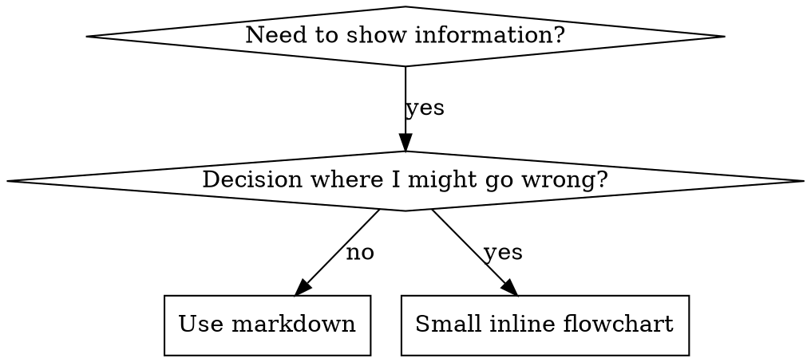

# Writing Skills
# 编写技能

## Overview
## 概述

**Writing skills IS Test-Driven Development applied to process documentation.**
**编写技能就是将测试驱动开发（TDD）应用于流程文档。**

**Personal skills live in agent-specific directories (`~/.claude/skills` for Claude Code, `~/.agents/skills/` for Codex)**
**个人技能位于 agent 专属目录中（Claude Code 使用 `~/.claude/skills`，Codex 使用 `~/.agents/skills/`）**

You write test cases (pressure scenarios with subagents), watch them fail (baseline behavior), write the skill (documentation), watch tests pass (agents comply), and refactor (close loopholes).
你编写测试用例（带子代理的压力场景），观察它们失败（基线行为），编写技能文档，观察测试通过（agent 遵循），然后重构（堵住漏洞）。

**Core principle:** If you didn't watch an agent fail without the skill, you don't know if the skill teaches the right thing.
**核心原则：** 如果你没有观察到 agent 在没有技能的情况下失败，你就不知道这个技能是否教对了东西。

**REQUIRED BACKGROUND:** You MUST understand superpowers:test-driven-development before using this skill. That skill defines the fundamental RED-GREEN-REFACTOR cycle. This skill adapts TDD to documentation.
**必需背景：** 使用本技能前，你必须理解 superpowers:test-driven-development。该技能定义了基础的 RED-GREEN-REFACTOR 循环。本技能将 TDD 适配到文档编写。

**Official guidance:** For Anthropic's official skill authoring best practices, see anthropic-best-practices.md. This document provides additional patterns and guidelines that complement the TDD-focused approach in this skill.
**官方指导：** 关于 Anthropic 官方技能编写最佳实践，参见 anthropic-best-practices.md。本文档提供补充 TDD 方法的额外模式和指南。

## What is a Skill?
## 什么是技能？

A **skill** is a reference guide for proven techniques, patterns, or tools. Skills help future Claude instances find and apply effective approaches.
**技能**是一份经过验证的技术、模式或工具的参考指南。技能帮助未来的 Claude 实例找到并应用有效的方法。

**Skills are:** Reusable techniques, patterns, tools, reference guides
**技能是：** 可复用的技术、模式、工具、参考指南

**Skills are NOT:** Narratives about how you solved a problem once
**技能不是：** 描述你一次如何解决问题

## TDD Mapping for Skills
## 技能的 TDD 映射

| TDD Concept | Skill Creation |
| TDD 概念 | 技能创建 |
|-------------|----------------|
| **Test case** | Pressure scenario with subagent |
| **测试用例** | 带子代理的压力场景 |
| **Production code** | Skill document (SKILL.md) |
| **生产代码** | 技能文档（SKILL.md） |
| **Test fails (RED)** | Agent violates rule without skill (baseline) |
| **测试失败（RED）** | Agent 无技能时违反规则（基线） |
| **Test passes (GREEN)** | Agent complies with skill present |
| **测试通过（GREEN）** | Agent 在有技能时遵守规则 |
| **Refactor** | Close loopholes while maintaining compliance |
| **重构** | 在保持合规性的同时堵住漏洞 |
| **Write test first** | Run baseline scenario BEFORE writing skill |
| **先写测试** | 在编写技能之前运行基线场景 |
| **Watch it fail** | Document exact rationalizations agent uses |
| **观察失败** | 记录 agent 使用的具体借口 |
| **Minimal code** | Write skill addressing those specific violations |
| **最小代码** | 编写针对这些具体违规的技能 |
| **Watch it pass** | Verify agent now complies |
| **观察通过** | 验证 agent 现在遵守规则 |
| **Refactor cycle** | Find new rationalizations → plug → re-verify |
| **重构循环** | 发现新借口 → 堵住 → 重新验证 |

The entire skill creation process follows RED-GREEN-REFACTOR.
整个技能创建过程遵循 RED-GREEN-REFACTOR。

## When to Create a Skill
## 何时创建技能

**Create when:**
**创建时机：**
- Technique wasn't intuitively obvious to you
  - **你之前没有直观想到的技术**
- You'd reference this again across projects
  - **你会在跨项目中再次参考**
- Pattern applies broadly (not project-specific)
  - **模式适用范围广（非项目专用）**
- Others would benefit
  - **他人也能受益**

**Don't create for:**
**不要为以下情况创建：**
- One-off solutions
  - **一次性解决方案**
- Standard practices well-documented elsewhere
  - **其他地方已有完善文档的标准实践**
- Project-specific conventions (put in CLAUDE.md)
  - **项目专用约定（放在 CLAUDE.md 中）**
- Mechanical constraints (if it's enforceable with regex/validation, automate it—save documentation for judgment calls)
  - **机械性约束（如果可以用正则/验证强制执行，就自动化——把文档留给需要判断的情况）**

## Skill Types
## 技能类型

### Technique
### 技术

Concrete method with steps to follow (condition-based-waiting, root-cause-tracing)
具体的方法和步骤（如 condition-based-waiting、root-cause-tracing）

### Pattern
### 模式

Way of thinking about problems (flatten-with-flags, test-invariants)
思考问题的方式（如 flatten-with-flags、test-invariants）

### Reference
### 参考

API docs, syntax guides, tool documentation (office docs)
API 文档、语法指南、工具文档（office docs）

## Directory Structure
## 目录结构


```
skills/
  skill-name/
    SKILL.md              # Main reference (required)
    SKILL.md              # 主参考文档（必需）
    supporting-file.*     # Only if needed
    supporting-file.*     # 仅在需要时添加
```

**Flat namespace** - all skills in one searchable namespace
**扁平命名空间** - 所有技能放在一个可搜索的命名空间下

**Separate files for:**
**单独文件的场景：**
1. **Heavy reference** (100+ lines) - API docs, comprehensive syntax
   **重量级参考**（100+ 行） - API 文档、全面的语法
2. **Reusable tools** - Scripts, utilities, templates
   **可复用工具** - 脚本、工具、模板

**Keep inline:**
**保持内联：**
- Principles and concepts
  - **原则和概念**
- Code patterns (< 50 lines)
  - **代码模式（< 50 行）**
- Everything else
  - **其他所有内容**

## SKILL.md Structure
## SKILL.md 结构

**Frontmatter (YAML):**
**前置元数据（YAML）：**
- Only two fields supported: `name` and `description`
  - **仅支持两个字段：`name` 和 `description`**
- Max 1024 characters total
  - **总字符数最多 1024**
- `name`: Use letters, numbers, and hyphens only (no parentheses, special chars)
  - **`name`：仅使用字母、数字和连字符（不使用括号、特殊字符）**
- `description`: Third-person, describes ONLY when to use (NOT what it does)
  - **`description`：第三人称，仅描述何时使用（不是做什么）**
  - Start with "Use when..." to focus on triggering conditions
    - **以 "Use when..." 开头，聚焦触发条件**
  - Include specific symptoms, situations, and contexts
    - **包含具体的症状、情况和上下文**
  - **NEVER summarize the skill's process or workflow** (see CSO section for why)
    - **永远不要在描述中总结技能的过程或工作流**（详见 CSO 部分的原因）
  - Keep under 500 characters if possible
    - **如果可能，保持在 500 字符以下**

```markdown
---
name: Skill-Name-With-Hyphens
description: Use when [specific triggering conditions and symptoms]
---

# Skill Name

## Overview
What is this? Core principle in 1-2 sentences.

## When to Use
[Small inline flowchart IF decision non-obvious]

Bullet list with SYMPTOMS and use cases
When NOT to use

## Core Pattern (for techniques/patterns)
Before/after code comparison

## Quick Reference
Table or bullets for scanning common operations

## Implementation
Inline code for simple patterns
Link to file for heavy reference or reusable tools

## Common Mistakes
What goes wrong + fixes

## Real-World Impact (optional)
Concrete results
```

```markdown
---
name: Skill-Name-With-Hyphens
description: Use when [specific triggering conditions and symptoms]
---

# 技能名称

## Overview
## 概述
这是什么？用 1-2 句话描述核心原则。

## When to Use
## 何时使用
[如果决策不明显，使用小型内联流程图]

带症状和使用场景的项目符号列表
何时不使用

## Core Pattern (for techniques/patterns)
## 核心模式（适用于技术/模式）
之前/之后的代码对比

## Quick Reference
## 快速参考
用于扫描常见操作的表格或项目符号

## Implementation
## 实现
简单模式的内联代码
重量级参考或可复用工具链接到文件

## Common Mistakes
## 常见错误
出问题的地方 + 修复方法

## Real-World Impact (optional)
## 实际影响（可选）
具体结果
```


## Claude Search Optimization (CSO)
## Claude 搜索优化（CSO）

**Critical for discovery:** Future Claude needs to FIND your skill
**发现的关键：** 未来的 Claude 需要找到你的技能

### 1. Rich Description Field
### 1. 丰富的描述字段

**Purpose:** Claude reads description to decide which skills to load for a given task. Make it answer: "Should I read this skill right now?"
**目的：** Claude 读取描述来决定为给定任务加载哪些技能。让它回答："我现在应该读这个技能吗？"

**Format:** Start with "Use when..." to focus on triggering conditions
**格式：** 以 "Use when..." 开头，聚焦触发条件

**CRITICAL: Description = When to Use, NOT What the Skill Does**
**关键：描述 = 何时使用，不是技能做什么**

The description should ONLY describe triggering conditions. Do NOT summarize the skill's process or workflow in the description.
描述应该只描述触发条件。不要在描述中总结技能的过程或工作流。

**Why this matters:** Testing revealed that when a description summarizes the skill's workflow, Claude may follow the description instead of reading the full skill content. A description saying "code review between tasks" caused Claude to do ONE review, even though the skill's flowchart clearly showed TWO reviews (spec compliance then code quality).
**为什么这很重要：** 测试发现，当描述总结技能的工作流时，Claude 可能遵循描述而不是阅读完整的技能内容。描述说"任务之间的代码审查"导致 Claude 做了一次审查，尽管技能的流程图明确显示了两步审查（规范合规性然后代码质量）。

When the description was changed to just "Use when executing implementation plans with independent tasks" (no workflow summary), Claude correctly read the flowchart and followed the two-stage review process.
当描述改为仅"Use when executing implementation plans with independent tasks"（无工作流总结）时，Claude 正确阅读了流程图并遵循了两阶段审查过程。

**The trap:** Descriptions that summarize workflow create a shortcut Claude will take. The skill body becomes documentation Claude skips.
**陷阱：** 总结工作流的描述会创造 Claude 会走的捷径。技能正文变成了 Claude 跳过的文档。

```yaml
# ❌ BAD: Summarizes workflow - Claude may follow this instead of reading skill
# ❌ 错误：总结工作流 - Claude 可能遵循此描述而不是阅读技能
description: Use when executing plans - dispatches subagent per task with code review between tasks

# ❌ BAD: Too much process detail
# ❌ 错误：过多的流程细节
description: Use for TDD - write test first, watch it fail, write minimal code, refactor

# ✅ GOOD: Just triggering conditions, no workflow summary
# ✅ 正确：只有触发条件，无工作流总结
description: Use when executing implementation plans with independent tasks in the current session

# ✅ GOOD: Triggering conditions only
# ✅ 正确：只有触发条件
description: Use when implementing any feature or bugfix, before writing implementation code
```

**Content:**
**内容：**
- Use concrete triggers, symptoms, and situations that signal this skill applies
  - **使用具体的触发因素、症状和情况，表明此技能适用**
- Describe the *problem* (race conditions, inconsistent behavior) not *language-specific symptoms* (setTimeout, sleep)
  - **描述*问题*（竞态条件、不一致行为）而不是*语言特定的症状*（setTimeout、sleep）**
- Keep triggers technology-agnostic unless the skill itself is technology-specific
  - **除非技能本身是技术特定的，否则保持触发条件技术无关**
- If skill is technology-specific, make that explicit in the trigger
  - **如果技能是技术特定的，在触发条件中明确说明**
- Write in third person (injected into system prompt)
  - **用第三人称写（注入到系统提示中）**
- **NEVER summarize the skill's process or workflow**
  - **永远不要总结技能的过程或工作流**

```yaml
# ❌ BAD: Too abstract, vague, doesn't include when to use
# ❌ 错误：太抽象、模糊，没有包含何时使用
description: For async testing

# ❌ BAD: First person
# ❌ 错误：第一人称
description: I can help you with async tests when they're flaky

# ❌ BAD: Mentions technology but skill isn't specific to it
# ❌ 错误：提到技术但技能本身并不特定于它
description: Use when tests use setTimeout/sleep and are flaky

# ✅ GOOD: Starts with "Use when", describes problem, no workflow
# ✅ 正确：以 "Use when" 开头，描述问题，无工作流
description: Use when tests have race conditions, timing dependencies, or pass/fail inconsistently

# ✅ GOOD: Technology-specific skill with explicit trigger
# ✅ 正确：技术特定的技能，有明确的触发条件
description: Use when using React Router and handling authentication redirects
```

### 2. Keyword Coverage
### 2. 关键词覆盖

Use words Claude would search for:
使用 Claude 会搜索的词语：
- Error messages: "Hook timed out", "ENOTEMPTY", "race condition"
  - **错误消息：** "Hook timed out"、"ENOTEMPTY"、"race condition"
- Symptoms: "flaky", "hanging", "zombie", "pollution"
  - **症状：** "flaky"、"hanging"、"zombie"、"pollution"
- Synonyms: "timeout/hang/freeze", "cleanup/teardown/afterEach"
  - **同义词：** "timeout/hang/freeze"、"cleanup/teardown/afterEach"
- Tools: Actual commands, library names, file types
  - **工具：** 实际命令、库名、文件类型

### 3. Descriptive Naming
### 3. 描述性命名

**Use active voice, verb-first:**
**使用主动语态，动词优先：**
- ✅ `creating-skills` not `skill-creation`
  - **✅ `creating-skills` 而不是 `skill-creation`**
- ✅ `condition-based-waiting` not `async-test-helpers`
  - **✅ `condition-based-waiting` 而不是 `async-test-helpers`**

### 4. Token Efficiency (Critical)
### 4. Token 效率（关键）

**Problem:** getting-started and frequently-referenced skills load into EVERY conversation. Every token counts.
**问题：** getting-started 和频繁引用的技能会加载到每个对话中。每个 token 都很重要。

**Target word counts:**
**目标字数：**
- getting-started workflows: <150 words each
  - **getting-started 工作流：每个 <150 词**
- Frequently-loaded skills: <200 words total
  - **频繁加载的技能：总共 <200 词**
- Other skills: <500 words (still be concise)
  - **其他技能：<500 词（仍然要简洁）**

**Techniques:**
**技巧：**

**Move details to tool help:**
**将细节移到工具帮助中：**
```bash
# ❌ BAD: Document all flags in SKILL.md
# ❌ 错误：在 SKILL.md 中记录所有标志
search-conversations supports --text, --both, --after DATE, --before DATE, --limit N

# ✅ GOOD: Reference --help
# ✅ 正确：参考 --help
search-conversations supports multiple modes and filters. Run --help for details.
```

**Use cross-references:**
**使用交叉引用：**
```markdown
# ❌ BAD: Repeat workflow details
# ❌ 错误：重复工作流细节
When searching, dispatch subagent with template...
[20 lines of repeated instructions]

# ✅ GOOD: Reference other skill
# ✅ 正确：引用其他技能
Always use subagents (50-100x context savings). REQUIRED: Use [other-skill-name] for workflow.
```

**Compress examples:**
**压缩示例：**
```markdown
# ❌ BAD: Verbose example (42 words)
# ❌ 错误：冗长的示例（42 词）
your human partner: "How did we handle authentication errors in React Router before?"
You: I'll search past conversations for React Router authentication patterns.
[Dispatch subagent with search query: "React Router authentication error handling 401"]

# ✅ GOOD: Minimal example (20 words)
# ✅ 正确：简洁的示例（20 词）
Partner: "How did we handle auth errors in React Router?"
You: Searching...
[Dispatch subagent → synthesis]
```

**Eliminate redundancy:**
**消除冗余：**
- Don't repeat what's in cross-referenced skills
  - **不要重复交叉引用技能中的内容**
- Don't explain what's obvious from command
  - **不要解释从命令中显而易见的内容**
- Don't include multiple examples of same pattern
  - **不要包含同一模式的多个示例**

**Verification:**
**验证：**
```bash
wc -w skills/path/SKILL.md
# getting-started workflows: aim for <150 each
# getting-started 工作流：目标每个 <150 词
# Other frequently-loaded: aim for <200 total
# 其他频繁加载的：目标总共 <200 词
```

**Name by what you DO or core insight:**
**用你做的事情或核心洞察来命名：**
- ✅ `condition-based-waiting` > `async-test-helpers`
- ✅ `using-skills` not `skill-usage`
  - **✅ `using-skills` 而不是 `skill-usage`**
- ✅ `flatten-with-flags` > `data-structure-refactoring`
- ✅ `root-cause-tracing` > `debugging-techniques`

**Gerunds (-ing) work well for processes:**
**动名词（-ing）适合描述过程：**
- `creating-skills`, `testing-skills`, `debugging-with-logs`
- Active, describes the action you're taking
  - **主动，描述你正在进行的动作**

### 4. Cross-Referencing Other Skills
### 4. 交叉引用其他技能

**When writing documentation that references other skills:**
**编写引用其他技能的文档时：**

Use skill name only, with explicit requirement markers:
仅使用技能名称，并带有明确的必需标记：
- ✅ Good: `**REQUIRED SUB-SKILL:** Use superpowers:test-driven-development`
  - **✅ 好：`**REQUIRED SUB-SKILL:** Use superpowers:test-driven-development`**
- ✅ Good: `**REQUIRED BACKGROUND:** You MUST understand superpowers:systematic-debugging`
  - **✅ 好：`**REQUIRED BACKGROUND:** You MUST understand superpowers:systematic-debugging`**
- ❌ Bad: `See skills/testing/test-driven-development` (unclear if required)
  - **❌ 错误：`See skills/testing/test-driven-development`（不明确是否必需）**
- ❌ Bad: `@skills/testing/test-driven-development/SKILL.md` (force-loads, burns context)
  - **❌ 错误：`@skills/testing/test-driven-development/SKILL.md`（强制加载，消耗上下文）**

**Why no @ links:** `@` syntax force-loads files immediately, consuming 200k+ context before you need them.
**为什么不使用 @ 链接：** `@` 语法立即强制加载文件，在你需要之前就消耗了 200k+ 上下文。

## Flowchart Usage
## 流程图使用



**Use flowcharts ONLY for:**
**仅在以下情况使用流程图：**
- Non-obvious decision points
  - **不明显的决策点**
- Process loops where you might stop too early
  - **你可能过早停止的流程循环**
- "When to use A vs B" decisions
  - **"何时使用 A vs B" 的决策**

**Never use flowcharts for:**
**永远不要为以下情况使用流程图：**
- Reference material → Tables, lists
  - **参考资料 → 表格、列表**
- Code examples → Markdown blocks
  - **代码示例 → Markdown 代码块**
- Linear instructions → Numbered lists
  - **线性指令 → 编号列表**
- Labels without semantic meaning (step1, helper2)
  - **没有语义含义的标签（step1、helper2）**

See @graphviz-conventions.dot for graphviz style rules.
参见 @graphviz-conventions.dot 了解 graphviz 样式规则。

**Visualizing for your human partner:** Use `render-graphs.js` in this directory to render a skill's flowcharts to SVG:
**为你的合作伙伴可视化：** 使用本目录中的 `render-graphs.js` 将技能的流程图渲染为 SVG：
```bash
./render-graphs.js ../some-skill           # Each diagram separately
./render-graphs.js ../some-skill           # 每个图单独渲染
./render-graphs.js ../some-skill --combine # All diagrams in one SVG
./render-graphs.js ../some-skill --combine # 所有图合并为一个 SVG
```

## Code Examples
## 代码示例

**One excellent example beats many mediocre ones**
**一个优秀的示例胜过许多平庸的示例**

Choose most relevant language:
选择最相关的语言：
- Testing techniques → TypeScript/JavaScript
  - **测试技术 → TypeScript/JavaScript**
- System debugging → Shell/Python
  - **系统调试 → Shell/Python**
- Data processing → Python
  - **数据处理 → Python**

**Good example:**
**好的示例：**
- Complete and runnable
  - **完整且可运行**
- Well-commented explaining WHY
  - **注释良好，解释原因**
- From real scenario
  - **来自真实场景**
- Shows pattern clearly
  - **清晰地展示模式**
- Ready to adapt (not generic template)
  - **可以改编（不是通用模板）**

**Don't:**
**不要：**
- Implement in 5+ languages
  - **用 5+ 种语言实现**
- Create fill-in-the-blank templates
  - **创建填空模板**
- Write contrived examples
  - **编写刻意编造的示例**

You're good at porting - one great example is enough.
你擅长移植——一个好的示例就足够了。

## File Organization
## 文件组织

### Self-Contained Skill
### 自包含技能
```
defense-in-depth/
  SKILL.md    # Everything inline
  SKILL.md    # 所有内容内联
```
When: All content fits, no heavy reference needed
何时：所有内容都适合，没有重量级参考需要

### Skill with Reusable Tool
### 带可复用工具的技能
```
condition-based-waiting/
  SKILL.md    # Overview + patterns
  SKILL.md    # 概述 + 模式
  example.ts  # Working helpers to adapt
  example.ts  # 可改编的工作助手
```
When: Tool is reusable code, not just narrative
何时：工具是可复用代码，而不仅仅是叙述

### Skill with Heavy Reference
### 带重量级参考的技能
```
pptx/
  SKILL.md       # Overview + workflows
  SKILL.md       # 概述 + 工作流
  pptxgenjs.md   # 600 lines API reference
  pptxgenjs.md   # 600 行 API 参考
  ooxml.md       # 500 lines XML structure
  ooxml.md       # 500 行 XML 结构
  scripts/       # Executable tools
  scripts/       # 可执行工具
```
When: Reference material too large for inline
何时：参考资料太大，无法内联

## The Iron Law (Same as TDD)
## 铁律（与 TDD 相同）

```
NO SKILL WITHOUT A FAILING TEST FIRST
没有失败的测试，就不能有技能
```

This applies to NEW skills AND EDITS to existing skills.
这适用于新技能和对现有技能的编辑。

Write skill before testing? Delete it. Start over.
测试前写技能？删除它。重新开始。
Edit skill without testing? Same violation.
编辑技能而不测试？同样的违规。

**No exceptions:**
**没有例外：**
- Not for "simple additions"
  - **不适用于"简单的添加"**
- Not for "just adding a section"
  - **不适用于"只是添加一个部分"**
- Not for "documentation updates"
  - **不适用于"文档更新"**
- Don't keep untested changes as "reference"
  - **不要将未测试的更改保留为"参考"**
- Don't "adapt" while running tests
  - **不要在运行测试时"改编"**
- Delete means delete
  - **删除就是删除**

**REQUIRED BACKGROUND:** The superpowers:test-driven-development skill explains why this matters. Same principles apply to documentation.
**必需背景：** superpowers:test-driven-development 技能解释了为什么这很重要。相同的原则适用于文档。

## Testing All Skill Types
## 测试所有技能类型

Different skill types need different test approaches:
不同类型的技能需要不同的测试方法：

### Discipline-Enforcing Skills (rules/requirements)
### 纪律强制技能（规则/要求）

**Examples:** TDD, verification-before-completion, designing-before-coding
**示例：** TDD、完成后验证、编码前设计

**Test with:**
**测试方式：**
- Academic questions: Do they understand the rules?
  - **学术问题：他们理解规则吗？**
- Pressure scenarios: Do they comply under stress?
  - **压力场景：他们在压力下遵守吗？**
- Multiple pressures combined: time + sunk cost + exhaustion
  - **多种压力组合：时间 + 沉没成本 + 疲惫**
- Identify rationalizations and add explicit counters
  - **识别借口并添加明确的反驳**

**Success criteria:** Agent follows rule under maximum pressure
**成功标准：** Agent 在最大压力下遵守规则

### Technique Skills (how-to guides)
### 技术技能（操作指南）

**Examples:** condition-based-waiting, root-cause-tracing, defensive-programming
**示例：** condition-based-waiting、root-cause-tracing、defensive-programming

**Test with:**
**测试方式：**
- Application scenarios: Can they apply the technique correctly?
  - **应用场景：他们能正确应用技术吗？**
- Variation scenarios: Do they handle edge cases?
  - **变化场景：他们处理边界情况吗？**
- Missing information tests: Do instructions have gaps?
  - **缺失信息测试：指令有漏洞吗？**

**Success criteria:** Agent successfully applies technique to new scenario
**成功标准：** Agent 成功将技术应用于新场景

### Pattern Skills (mental models)
### 模式技能（思维模型）

**Examples:** reducing-complexity, information-hiding concepts
**示例：** reducing-complexity、information-hiding concepts

**Test with:**
**测试方式：**
- Recognition scenarios: Do they recognize when pattern applies?
  - **识别场景：他们能识别模式何时适用吗？**
- Application scenarios: Can they use the mental model?
  - **应用场景：他们能使用思维模型吗？**
- Counter-examples: Do they know when NOT to apply?
  - **反例：他们知道何时不应用吗？**

**Success criteria:** Agent correctly identifies when/how to apply pattern
**成功标准：** Agent 正确识别何时/如何使用模式

### Reference Skills (documentation/APIs)
### 参考技能（文档/API）

**Examples:** API documentation, command references, library guides
**示例：** API 文档、命令参考、库指南

**Test with:**
**测试方式：**
- Retrieval scenarios: Can they find the right information?
  - **检索场景：他们能找到正确的信息吗？**
- Application scenarios: Can they use what they found correctly?
  - **应用场景：他们能正确使用找到的内容吗？**
- Gap testing: Are common use cases covered?
  - **漏洞测试：常见用例是否都有覆盖？**

**Success criteria:** Agent finds and correctly applies reference information
**成功标准：** Agent 找到并正确应用参考信息

## Common Rationalizations for Skipping Testing
## 跳过测试的常见借口

| Excuse | Reality |
| 借口 | 现实 |
|--------|---------|
| "Skill is obviously clear" | Clear to you ≠ clear to other agents. Test it. |
| "技能显然很清楚" | 你清楚 ≠ 其他 agent 清楚。测试它。 |
| "It's just a reference" | References can have gaps, unclear sections. Test retrieval. |
| "这只是一个参考" | 参考可能有漏洞、不清楚的部分。测试检索。 |
| "Testing is overkill" | Untested skills have issues. Always. 15 min testing saves hours. |
| "测试是过度杀鸡用牛刀" | 未测试的技能总有问题。一直都是。15 分钟测试节省数小时。 |
| "I'll test if problems emerge" | Problems = agents can't use skill. Test BEFORE deploying. |
| "如果出现问题我会测试" | 问题 = agent 无法使用技能。部署前测试。 |
| "Too tedious to test" | Testing is less tedious than debugging bad skill in production. |
| "测试太繁琐" | 测试比在生产中调试糟糕的技能更省事。 |
| "I'm confident it's good" | Overconfidence guarantees issues. Test anyway. |
| "我确信它很好" | 过度自信保证会出问题。还是测试。 |
| "Academic review is enough" | Reading ≠ using. Test application scenarios. |
| "学术审查就够了" | 阅读 ≠ 使用。测试应用场景。 |
| "No time to test" | Deploying untested skill wastes more time fixing it later. |
| "没时间测试" | 部署未测试的技能会浪费更多时间在之后修复。 |

**All of these mean: Test before deploying. No exceptions.**
**所有这些都意味着：部署前测试。没有例外。**

## Bulletproofing Skills Against Rationalization
## 使技能防借口化

Skills that enforce discipline (like TDD) need to resist rationalization. Agents are smart and will find loopholes when under pressure.
强制纪律的技能（如 TDD）需要抵抗借口。Agent 很聪明，在压力下会找到漏洞。

**Psychology note:** Understanding WHY persuasion techniques work helps you apply them systematically. See persuasion-principles.md for research foundation (Cialdini, 2021; Meincke et al., 2025) on authority, commitment, scarcity, social proof, and unity principles.
**心理学提示：** 理解说服技巧为什么有效帮助你系统地应用它们。参见 persuasion-principles.md 了解研究基础（Cialdini, 2021; Meincke et al., 2025）关于权威、承诺、稀缺、社会认同和统一原则。

### Close Every Loophole Explicitly
### 明确关闭每个漏洞

Don't just state the rule - forbid specific workarounds:
不要只是陈述规则——禁止具体的变通方法：

<Bad>
```markdown
Write code before test? Delete it.
```
</Bad>
<Bad>
```markdown
Write code before test? Delete it.
测试前写代码？删除它。
```
</Bad>

<Good>
```markdown
Write code before test? Delete it. Start over.
测试前写代码？删除它。重新开始。

**No exceptions:**
**没有例外：**
- Don't keep it as "reference"
  - **不要把它保留为"参考"**
- Don't "adapt" it while writing tests
  - **不要在写测试时"改编"它**
- Don't look at it
  - **不要看它**
- Delete means delete
  - **删除就是删除**
```
</Good>

### Address "Spirit vs Letter" Arguments
### 解决"精神 vs 字面"争论

Add foundational principle early:
尽早添加基本原则：

```markdown
**Violating the letter of the rules is violating the spirit of the rules.**
**违反规则的字面就是违反规则的精神。**
```

This cuts off entire class of "I'm following the spirit" rationalizations.
这切断了一整类"我遵循精神"的借口。

### Build Rationalization Table
### 建立借口表

Capture rationalizations from baseline testing (see Testing section below). Every excuse agents make goes in the table:
从基线测试中捕获借口（参见下面的测试部分）。Agent 使用的每个借口都进入表格：

```markdown
| Excuse | Reality |
|--------|---------|
| "Too simple to test" | Simple code breaks. Test takes 30 seconds. |
| "It's about spirit not ritual" | Violating the letter violates the spirit. |
| "I'll test after" | Tests passing immediately prove nothing. |
```
```markdown
| Excuse | Reality |
| 借口 | 现实 |
|--------|---------|
| "太简单，不需要测试" | 简单代码也会出问题。测试只需 30 秒。 |
| "这关乎精神，不是仪式" | 违反字面就是违反精神。 |
| "我之后会测试" | 测试立即通过什么都证明不了。 |
```

### Create Red Flags List
### 创建红旗列表

Make it easy for agents to self-check when rationalizing:
让 agent 在找借口时轻松自我检查：

```markdown
## Red Flags - STOP and Start Over
## 红旗 - 停下来，重新开始

- Code before test
  - **测试前写代码**
- "I already manually tested it"
  - **"我已经手动测试过了"**
- "Tests after achieve the same purpose"
  - **"之后测试也能达到同样目的"**
- "It's about spirit not ritual"
  - **"这关乎精神，不是仪式"**
- "This is different because..."
  - **"这不一样，因为..."**

**All of these mean: Delete code. Start over with TDD.**
**所有这些都意味着：删除代码。用 TDD 重新开始。**
```

### Update CSO for Violation Symptoms
### 更新 CSO 的违规症状

Add to description: symptoms of when you're ABOUT to violate the rule:
添加到描述中：你即将违反规则时的症状：

```yaml
description: use when implementing any feature or bugfix, before writing implementation code
```

## RED-GREEN-REFACTOR for Skills
## 技能的 RED-GREEN-REFACTOR

Follow the TDD cycle:
遵循 TDD 循环：

### RED: Write Failing Test (Baseline)
### RED：编写失败的测试（基线）

Run pressure scenario with subagent WITHOUT the skill. Document exact behavior:
使用子代理运行压力场景，不使用技能。记录具体行为：
- What choices did they make?
  - **他们做了什么选择？**
- What rationalizations did they use (verbatim)?
  - **他们用了什么借口（原文）？**
- Which pressures triggered violations?
  - **哪些压力触发了违规？**

This is "watch the test fail" - you must see what agents naturally do before writing the skill.
这就是"观察测试失败"——你必须在写技能之前看到 agent 自然会做什么。

### GREEN: Write Minimal Skill
### GREEN：编写最小技能

Write skill that addresses those specific rationalizations. Don't add extra content for hypothetical cases.
编写针对这些具体借口的技能。不要为假设情况添加额外内容。

Run same scenarios WITH skill. Agent should now comply.
使用技能运行相同场景。Agent 现在应该遵守了。

### REFACTOR: Close Loopholes
### REFACTOR：关闭漏洞

Agent found new rationalization? Add explicit counter. Re-test until bulletproof.
Agent 发现了新的借口？添加明确的反驳。重新测试直到无懈可击。

**Testing methodology:** See @testing-skills-with-subagents.md for the complete testing methodology:
**测试方法：** 参见 @testing-skills-with-subagents.md 了解完整测试方法：
- How to write pressure scenarios
  - **如何编写压力场景**
- Pressure types (time, sunk cost, authority, exhaustion)
  - **压力类型（时间、沉没成本、权威、疲惫）**
- Plugging holes systematically
  - **系统地堵住漏洞**
- Meta-testing techniques
  - **元测试技术**

## Anti-Patterns
## 反模式

### ❌ Narrative Example
### ❌ 叙述性示例
"In session 2025-10-03, we found empty projectDir caused..."
"In session 2025-10-03, we found empty projectDir caused..."
"In session 2025-10-03, we found empty projectDir caused..."
**Why bad:** Too specific, not reusable
**为什么不好：** 太具体，不可复用

### ❌ Multi-Language Dilution
### ❌ 多语言稀释
example-js.js, example-py.py, example-go.go
**Why bad:** Mediocre quality, maintenance burden
**为什么不好：** 质量平庸，维护负担

### ❌ Code in Flowcharts
### ❌ 流程图中的代码
```dot
step1 [label="import fs"];
step2 [label="read file"];
```
**Why bad:** Can't copy-paste, hard to read
**为什么不好：** 无法复制粘贴，难以阅读

### ❌ Generic Labels
### ❌ 通用标签
helper1, helper2, step3, pattern4
**Why bad:** Labels should have semantic meaning
**为什么不好：** 标签应该有语义含义

## STOP: Before Moving to Next Skill
## 停止：转到下一个技能之前

**After writing ANY skill, you MUST STOP and complete the deployment process.**
**编写完任何技能后，你必须停下来并完成部署过程。**

**Do NOT:**
**不要：**
- Create multiple skills in batch without testing each
  - **批量创建多个技能而不测试每个**
- Move to next skill before current one is verified
  - **在当前技能验证完成前转到下一个**
- Skip testing because "batching is more efficient"
  - **因为"批量更高效"而跳过测试**

**The deployment checklist below is MANDATORY for EACH skill.**
**下面的部署清单对每个技能都是强制性的。**

Deploying untested skills = deploying untested code. It's a violation of quality standards.
部署未测试的技能 = 部署未测试的代码。这是违反质量标准的行为。

## Skill Creation Checklist (TDD Adapted)
## 技能创建清单（TDD 适配版）

**IMPORTANT: Use TodoWrite to create todos for EACH checklist item below.**
**重要：使用 TodoWrite 为下面的每个清单项目创建待办事项。**

**RED Phase - Write Failing Test:**
**RED 阶段 - 编写失败的测试：**
- [ ] Create pressure scenarios (3+ combined pressures for discipline skills)
  - **[ ] 创建压力场景（纪律技能需要 3+ 种组合压力）**
- [ ] Run scenarios WITHOUT skill - document baseline behavior verbatim
  - **[ ] 不使用技能运行场景 - 逐字记录基线行为**
- [ ] Identify patterns in rationalizations/failures
  - **[ ] 识别借口/失败中的模式**

**GREEN Phase - Write Minimal Skill:**
**GREEN 阶段 - 编写最小技能：**
- [ ] Name uses only letters, numbers, hyphens (no parentheses/special chars)
  - **[ ] 名称仅使用字母、数字、连字符（无括号/特殊字符）**
- [ ] YAML frontmatter with only name and description (max 1024 chars)
  - **[ ] YAML 前置数据仅包含 name 和 description（最多 1024 字符）**
- [ ] Description starts with "Use when..." and includes specific triggers/symptoms
  - **[ ] 描述以 "Use when..." 开头，包含具体的触发/症状**
- [ ] Description written in third person
  - **[ ] 描述用第三人称写**
- [ ] Keywords throughout for search (errors, symptoms, tools)
  - **[ ] 全文使用关键词以便搜索（错误、症状、工具）**
- [ ] Clear overview with core principle
  - **[ ] 清晰的概述和核心原则**
- [ ] Address specific baseline failures identified in RED
  - **[ ] 解决 RED 中识别的具体基线失败**
- [ ] Code inline OR link to separate file
  - **[ ] 代码内联或链接到单独文件**
- [ ] One excellent example (not multi-language)
  - **[ ] 一个优秀的示例（非多语言）**
- [ ] Run scenarios WITH skill - verify agents now comply
  - **[ ] 使用技能运行场景 - 验证 agent 现在遵守了**

**REFACTOR Phase - Close Loopholes:**
**REFACTOR 阶段 - 关闭漏洞：**
- [ ] Identify NEW rationalizations from testing
  - **[ ] 从测试中识别新的借口**
- [ ] Add explicit counters (if discipline skill)
  - **[ ] 添加明确的反驳（如果是纪律技能）**
- [ ] Build rationalization table from all test iterations
  - **[ ] 从所有测试迭代中建立借口表**
- [ ] Create red flags list
  - **[ ] 创建红旗列表**
- [ ] Re-test until bulletproof
  - **[ ] 重新测试直到无懈可击**

**Quality Checks:**
**质量检查：**
- [ ] Small flowchart only if decision non-obvious
  - **[ ] 仅在决策不明显时使用小型流程图**
- [ ] Quick reference table
  - **[ ] 快速参考表格**
- [ ] Common mistakes section
  - **[ ] 常见错误部分**
- [ ] No narrative storytelling
  - **[ ] 不要叙述性讲故事**
- [ ] Supporting files only for tools or heavy reference
  - **[ ] 支持文件仅用于工具或重量级参考**

**Deployment:**
**部署：**
- [ ] Commit skill to git and push to your fork (if configured)
  - **[ ] 将技能提交到 git 并推送到你的 fork（如果已配置）**
- [ ] Consider contributing back via PR (if broadly useful)
  - **[ ] 考虑通过 PR 贡献回来（如果广泛有用）**

## Discovery Workflow
## 发现工作流

How future Claude finds your skill:
未来的 Claude 如何找到你的技能：

1. **Encounters problem** ("tests are flaky")
   **遇到问题**（"测试不稳定"）
2. **Finds SKILL** (description matches)
   **找到技能**（描述匹配）
3. **Scans overview** (is this relevant?)
   **扫描概述**（这相关吗？）
4. **Reads patterns** (quick reference table)
   **阅读模式**（快速参考表）
5. **Loads example** (only when implementing)
   **加载示例**（仅在实现时）

**Optimize for this flow** - put searchable terms early and often.
**为这个流程优化** - 尽早且频繁地放置可搜索的术语。

## The Bottom Line
## 底线

**Creating skills IS TDD for process documentation.**
**创建技能就是流程文档的 TDD。**

Same Iron Law: No skill without failing test first.
同样的铁律：没有失败的测试，就不能有技能。
Same cycle: RED (baseline) → GREEN (write skill) → REFACTOR (close loopholes).
同样的循环：RED（基线）→ GREEN（写技能）→ REFACTOR（堵住漏洞）。
Same benefits: Better quality, fewer surprises, bulletproof results.
同样的好处：更好的质量、更少的意外、无懈可击的结果。

If you follow TDD for code, follow it for skills. It's the same discipline applied to documentation.
如果你在代码中遵循 TDD，在技能中也要遵循。这是同一纪律应用于文档。
